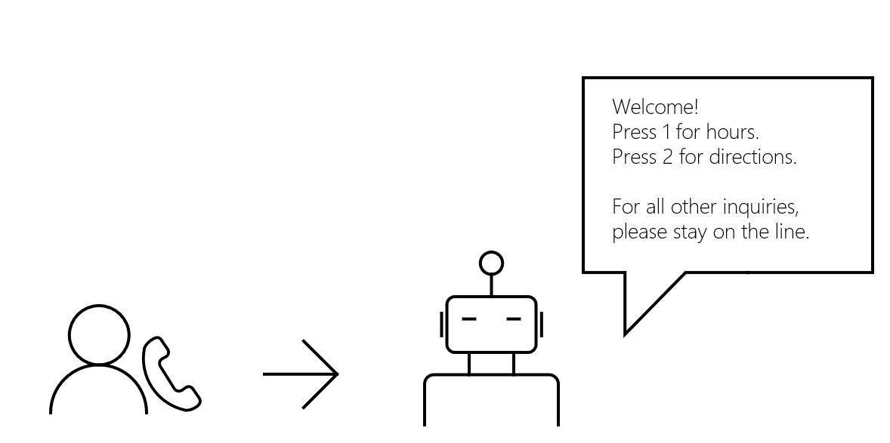
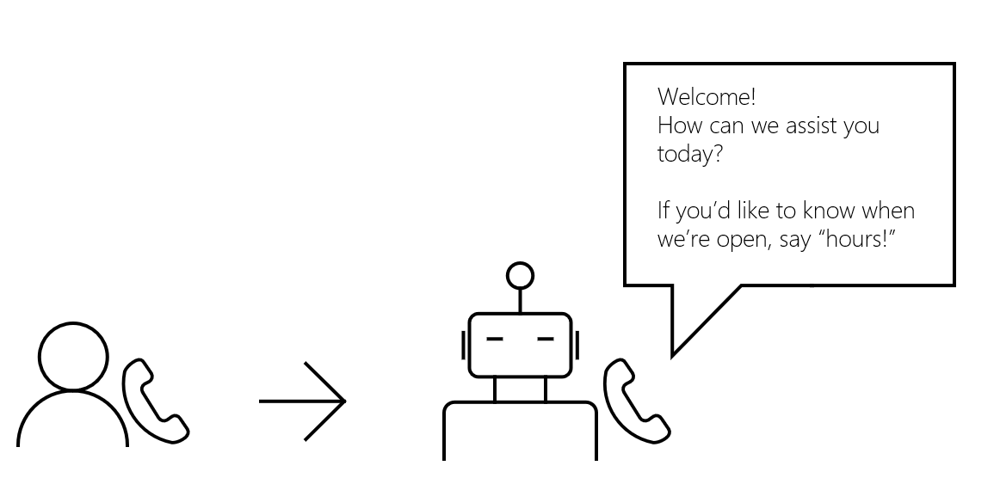

# Visão geral da API de comunicações em nuvem
As APIs de comunicação em nuvem no Microsoft Graph adicionam uma nova dimensão a como seus aplicativos e serviços interagem com os usuários por meio de vários recursos relacionados a comunicações, como chamadas e reuniões online. Expanda sua empresa expedido o modo como você responde às necessidades dos clientes e como seus funcionários colaboram entre si.

## Por que integrar com as APIs de comunicação em nuvem?

Descubra os benefícios de usar as APIs de comunicação em nuvem para[bots](https://microsoftgraph.github.io/microsoft-graph-comms-samples/docs/articles/calls/register-calling-bot.html?q=create%20bot)(aplicativos de serviço do buid).

### Gerenciar chamadas de entrada

Pode ser difícil em momentos em que os funcionários recebem muitas chamadas de negócios e não são possíveis, ou produtivos, para responder a todos eles. Um bot pode servir como um assistente de área de mesa e lidar com essas chamadas rejeitando o que parece ser chamado de spam e redirecionando (encaminhando) chamadas específicas para um número diferente.

Você pode usar as APIs de comunicação em nuvem para:

- Peça para um usuário [chamar um bot](/graph/api/application-post-calls?view=graph-rest-1.0) por meio de VoIP.
- Peça a um bot para [redirecionar a chamada de entrada](/graph/api/call-redirect?view=graph-rest-1.0) para o agente apropriado, se necessário.
- Ter um bot [responda](/graph/api/call-answer?view=graph-rest-1.0) ou [rejeite](/graph/api/call-reject?view=graph-rest-1.0) a chamada.

### Simplificar a experiência de atendimento ao cliente
Se você é proprietário de um grande serviço de assistência técnica ou de uma pequena loja, pode ser difícil lidar com várias solicitações de clientes, especialmente se você não tem nenhum contexto de qual problema eles estão tentando resolver antecipadamente. Gerenciar chamadas de entrada de clientes por meio de um sistema de **resposta de voz interativa** (IVR), onde um bot irá interagir com eles inicialmente.

Quando um cliente é solicitado por uma resposta do bot, o cliente pode pressionar uma tecla no teclado que corresponde à seleção. O bot pode então coletar a multifrequência de Tom de discagem (DTMF) do cliente.

Você pode usar as APIs de comunicação em nuvem para criar um bot que:

- [Responde a uma chamada](/graph/api/call-answer?view=graph-rest-1.0) de um cliente.
- [Reproduz um prompt](/graph/api/call-playprompt?view=graph-rest-1.0) para informar e solicitar a um cliente uma seleção.
- [Assina um tom](/graph/api/call-subscribetotone?view=graph-rest-1.0) para coletar o DTMF de um cliente.
- [Transfere um cliente](/graph/api/call-transfer?view=graph-rest-1.0) para um agente.
- [Finaliza uma chamada](/graph/api/call-delete?view=graph-rest-1.0) com um cliente.

Para criar uma interação mais inteligente entre seus clientes e seu bot, quando um cliente for solicitado por uma resposta, eles poderão falar diretamente com o que precisam de ajuda.

A integração com um serviço de processamento de idioma natural significa que a fala do cliente pode ser analisada por seu insignificante. O bot pode então responder às necessidades do cliente de acordo.

>**Observação:** Você não pode gravar ou manter o conteúdo de mídia de chamadas ou reuniões que seu aplicativo acessa ou dados derivados desse conteúdo de mídia. Certifique-se de que você está em conformidade com as leis e regulamentos de sua área em relação à proteção de dados e à confidencialidade das comunicações. Confira os [Termos de Uso](https://docs.microsoft.com/legal/microsoft-apis/terms-of-use) e converse com sua assessoria jurídica para saber mais.

Você pode usar as APIs de comunicação em nuvem para criar um bot que:

- [Responde a uma chamada](/graph/api/call-answer?view=graph-rest-1.0) de um cliente.
- [Reproduz um prompt](/graph/api/call-playprompt?view=graph-rest-1.0) para informar e solicitar que o cliente fale.
- [Registra um clipe de áudio curto](/graph/api/call-record?view=graph-rest-1.0) de um cliente falando.
- [Reproduz um prompt](/graph/api/call-playprompt?view=graph-rest-1.0) com a resposta adequada ao cliente, após a análise da fala.

### Colaborar por meio de chamadas de grupo
Permitir que os usuários participem de colegas de trabalho, criando uma chamada de grupo para que todos possam contribuir para a conversa.

Você pode usar as APIs de comunicação em nuvem para criar um bot que:

- [Cria uma chamada de grupo](/graph/api/application-post-calls?view=graph-rest-1.0#example-3-create-a-group-call-with-service-hosted-media) com vários participantes.
- [Convida outro bot ou usuário](/graph/api/participant-invite?view=graph-rest-1.0) para uma chamada de grupo existente.
- [Une uma chamada de grupo existente](/graph/api/application-post-calls?view=graph-rest-1.0#example-5-join-scheduled-meeting-with-service-hosted-media) como um bot.
- [Lista os participantes](/graph/api/call-list-participants?view=graph-rest-1.0) na chamada do grupo.
- [Desativa outro participante](/graph/api/participant-mute?view=graph-rest-1.0).

### Enviar lembretes de forma confiável
Para permitir que os usuários enviem aos clientes um lembrete para um compromisso ou um lembrete para um prazo de pagamento que está se aproximando, você pode fazer com que um bot chame o cliente automaticamente. <!--If the customer misses the call, it will leave a voicemail with the automated message. (Add this back once bot to PSTN calling works)-->

Você pode usar as APIs de comunicação em nuvem para criar um bot que:

- [Chama um cliente](/graph/api/application-post-calls?view=graph-rest-1.0) no Teams.
- [Reproduz um prompt gravado](/graph/api/call-playprompt?view=graph-rest-1.0) para servir como um lembrete.
- [Finaliza a chamada](/graph/api/call-delete?view=graph-rest-1.0).

### Configurar reuniões online
Seja para agendar uma reunião entre um médico e um paciente ou entre um usuário e seus subordinados diretos, você pode criar soluções que gerem reuniões que os usuários podem confiar. Para flexibilidade adicional, os usuários podem ligar para outros usuários e convidá-los para a reunião enquanto estiverem em andamento.

Você pode usar as APIs de comunicação em nuvem para:

- Peça para um usuário [criar uma reunião online](/graph/api/application-post-onlinemeetings?view=graph-rest-1.0).
- Peça para [o usuário recuperar os detalhes](/graph/api/onlinemeeting-get?view=graph-rest-1.0) de uma reunião online.
- Ter um bot ou um usuário [ingressar em uma reunião online](/graph/api/application-post-calls?view=graph-rest-1.0#example-5-join-scheduled-meeting-with-service-hosted-media).

## Referência da API
Está procurando a referência de API para esse serviço?

- [APIs de comunicações em nuvem no Microsoft Graph (v 1.0)](/graph/api/resources/communications-api-overview?view=graph-rest-1.0)
- [APIs de comunicações em nuvem no Microsoft Graph (beta)](/graph/api/resources/calls-api-overview?view=graph-rest-beta)

## Próximas etapas

- Use bots para [começar](cloud-communications-get-started.md).
- Saiba mais sobre [chamadas](cloud-communications-calls.md), [mídia](cloud-communications-media.md)e [reuniões online](cloud-communications-online-meetings.md).
- Exibir os [limites](cloud-communications-limits.md)de uso da API.
- Saiba como [gerenciar números de telefone](cloud-communications-phone-number.md) para seus bots.

## Confira também

- [Permissões delegadas e de aplicativo](https://docs.microsoft.com/azure/active-directory/develop/v1-permissions-and-consent)
- [Permissões de chamadas](/graph/permissions-reference#calls-permissions)
- [Permissões de reunião online](/graph/permissions-reference#online-meetings-permissions)
- [Exemplos de comunicações em nuvem](https://github.com/microsoftgraph/microsoft-graph-comms-samples)

