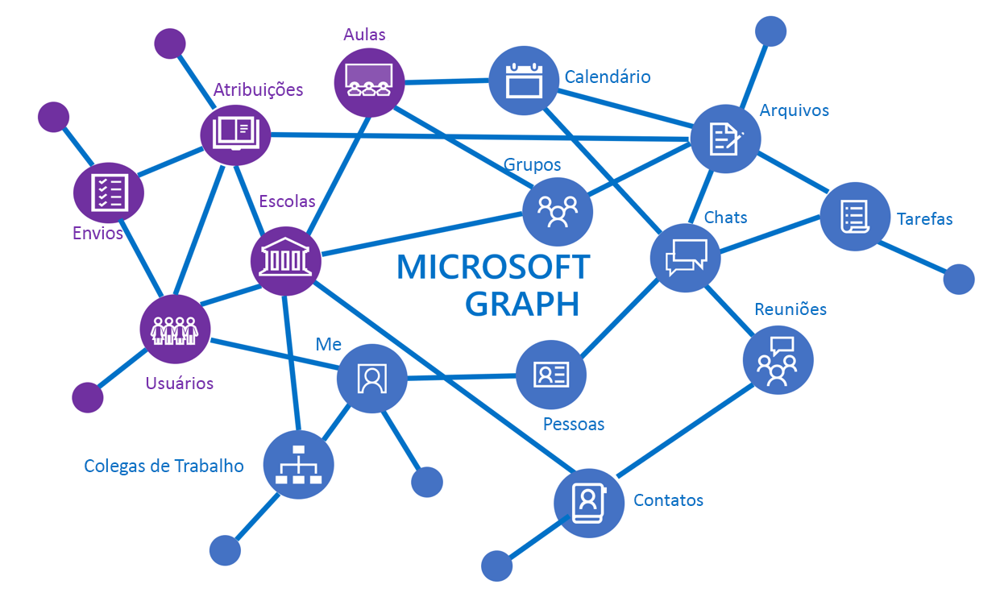
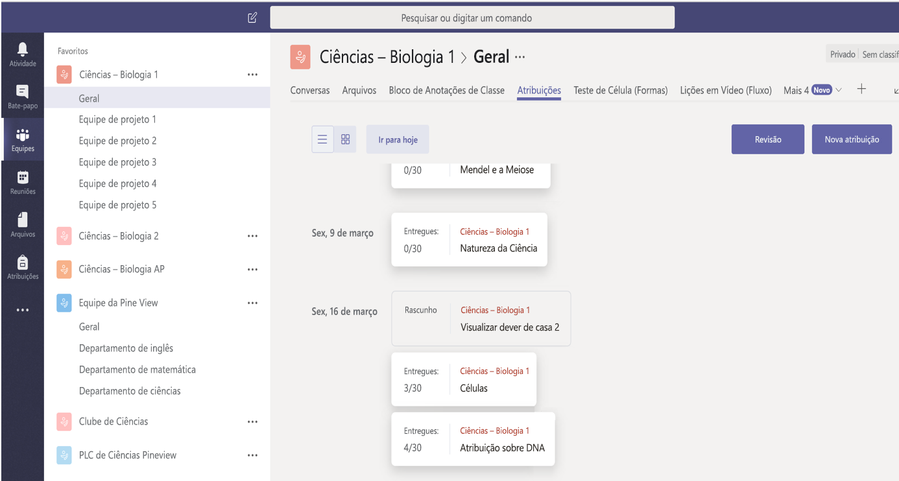

# Visão geral da API de educação

A API educacional do Microsoft Graph aprimora os recursos do Office 365 com informações relevantes para cenários educacionais, incluindo informações sobre escolas, aulas, usuários (alunos e professores), tarefas e trabalhos. Isso facilita a criação de soluções que se integrem aos recursos educacionais para vários cenários da escola e da sala de aula.

A API educacional do Microsoft Graph fornece acesso a aulas, escolas, usuários, tarefas, trabalhos e muito mais.

## Por que se integrar aos cenários educativos?

### Criar aplicativos que reconhecem a lista de participantes do curso

A maioria dos desenvolvedores de softwares educacionais sabe desde o início que essa lista de participantes do curso é uma das principais informações necessárias à execução do aplicativo, e geralmente ela está “presa” no Sistema de Informações do Aluno (SIS, Student Information System) da escola. Sempre que os professores utilizam um novo aplicativo na sala de aula, eles perdem tempo importando manualmente os dados da lista de participação para o aplicativo. Muitos ISVs abordam isso se conectando a um SIS para importar os dados da lista de participação. Com centenas de SIS com formatos proprietários, isso pode se tornar um desafio. O [Microsoft School Data Sync](https://sds.microsoft.com/), combinado às APIs de lista de participação, lida com esse desafio para desenvolvedores de aplicativos e escolas.

Vejamos a seguir alguns dos cenários permitidos pelas APIs de lista de participação:

- [Obter todas as aulas de uma escola](https://developer.microsoft.com/pt-BR/graph/docs/api-reference/v1.0/api/educationschool_list_classes)
- [Obter todos os usuários de uma aula](https://developer.microsoft.com/pt-BR/graph/docs/api-reference/v1.0/api/educationclass_list_members)
- [Obter todas as aulas que eu ensino](https://developer.microsoft.com/pt-BR/graph/docs/api-reference/v1.0/api/educationuser_list_classes)

### Usar o Microsoft Teams para criar tarefas da aula em uma guia de tarefas

Você pode usar a API de tarefas para criar um aplicativo Web que gerencia as tarefas da aula e, em seguida, integrar o seu aplicativo ao Microsoft Teams em uma nova guia personalizada.  

O Microsoft Teams no Office 365 é um hub digital que reúne conversas, conteúdo e aplicativos em um só lugar para as salas de aula. O Microsoft Teams oferece um [conjunto avançado de pontos de extensibilidade](https://docs.microsoft.com/pt-BR/microsoftteams/platform/concepts/apps/apps-overview), incluindo a criação de guias, conectores e bots. Esses pontos de extensibilidade podem chamar as APIs educacionais do Microsoft Graph para lidar com tarefas e trabalhos. Crie uma experiência mais abrangente habilitando o seu ponto de extensão com qualquer outra API do Microsoft Graph e as APIs de tarefa e de trabalhos.

Para o setor educacional, os aplicativos de guia personalizada do Microsoft Teams são abertos em um contexto de sala de aula educacional (uma equipe), onde faz sentido gerenciar o fluxo de tarefas de ponta a ponta, desde a criação e a distribuição até as notas e o feedback. Isso é apenas um exemplo de como o Microsoft Teams economiza tempo e simplifica a logística do dia a dia, deixando os educadores livres para se dedicarem aos alunos.

A imagem a seguir mostra um aplicativo Web para gerenciar tarefas em uma guia personalizada denominada Tarefas para uma aula de **Ciência – Biologia 1**.

Com a API de tarefas, o seu aplicativo pode interagir com o serviço de tarefas fora do Microsoft Teams. O Microsoft Teams cuida da distribuição, das datas de conclusão e das notas, enquanto o sistema pode fornecer uma experiência avançada de aprendizagem aos alunos.
Vejamos a seguir exemplos de alguns cenários habilitados pela API de tarefas:

- [Adicionar uma tarefa que se vincula ao seu aplicativo](https://developer.microsoft.com/pt-BR/graph/docs/api-reference/beta/api/educationclass_post_assignments) 
- [Atribuir notas a alunos individuais para as tarefas vinculadas ao seu aplicativo](https://developer.microsoft.com/pt-BR/graph/docs/api-reference/beta/api/educationsubmission_update)
- [Criar um painel do aluno para mostrar as tarefas cuja data de entrega já passou](https://developer.microsoft.com/pt-BR/graph/docs/api-reference/beta/api/educationclass_list_assignments)

## Permitir que os diretores de escola gerenciem a identidade e a sincronização da lista de participação usando o Gerenciamento do School Data Sync (visualização)

O [School Data Sync](https://sds.microsoft.com/) ajuda a automatizar o processo de importação e sincronização da identidade do aluno e dos dados de lista de participação a partir de sistemas de informações do aluno com o Azure Active Directory (Azure AD) e o Office 365. Após as informações serem sincronizadas, você pode usar as APIs de lista de participação para ler as informações da lista nos aplicativos. Se você for um integrador de sistema configurando a integração do Sistema de Informações do Aluno de uma escola com a School Data Sync, use as [APIs de gerenciamento do SDS](https://developer.microsoft.com/pt-BR/graph/docs/api-reference/beta/resources/educationsynchronizationprofile) do Microsoft Graph para configurar a sincronização de um arquivo CSV ou de um conector da API do SIS compatível.

As APIs de gerenciamento da School Data Sync oferecem suporte a cenários completos para o gerenciamento de sincronização, por exemplo:

- [Criar um perfil que inicia automaticamente a sincronização](https://developer.microsoft.com/pt-BR/graph/docs/api-reference/beta/api/educationsynchronizationprofile_post)
- Gerenciar o ciclo de vida da sincronização com as operações [pausar](https://developer.microsoft.com/pt-BR/graph/docs/api-reference/beta/api/educationsynchronizationprofile_pause), [retomar](https://developer.microsoft.com/pt-BR/graph/docs/api-reference/beta/api/educationsynchronizationprofile_resume) e [redefinir](https://developer.microsoft.com/pt-BR/graph/docs/api-reference/beta/api/educationsynchronizationprofile_reset)

## Próximas etapas

- Para começar a usar as APIs educacionais, consulte:
    - [Usar as APIs de lista de participantes](https://developer.microsoft.com/pt-BR/graph/docs/api-reference/v1.0/resources/education-overview)
    - [Usar as APIs de tarefa](https://developer.microsoft.com/pt-BR/graph/docs/api-reference/beta/resources/educationassignment)
    - [Usar as APIs de gerenciamento de SDS](https://developer.microsoft.com/pt-BR/graph/docs/api-reference/beta/resources/educationsynchronizationprofile)
- Experimente as APIs de educação no [Explorador do Graph](https://developer.microsoft.com/pt-BR/graph/graph-explorer).
- Explore os seguintes exemplos relacionados ao setor educacional:
    - [Exemplo de SSO e lista de participantes em .NET](https://github.com/OfficeDev/O365-EDU-AspNetMVC-Samples)
    - [Exemplo de nó angular para SSO e Lista de participantes](https://github.com/OfficeDev/O365-EDU-AngularNodeJS-Samples)   
    - [Exemplo de SSO e Lista de participantes em Python](https://github.com/OfficeDev/O365-EDU-Python-Samples)
    - [Exemplo de SSO e Lista de participantes em PHP](https://github.com/OfficeDev/O365-EDU-PHP-Samples)
    - [Exemplo de APIs de gerenciamento de perfil](https://github.com/OfficeDev/O365-EDU-SDS-AspNetMVC-Samples) 

 

