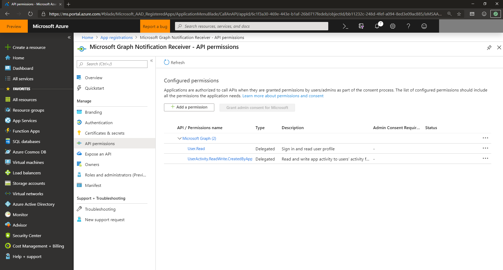

# Gerenciar registro do aplicativo e permissão de API para notificações do Microsoft Graph

Para que o serviço do aplicativo se integre às notificações do Microsoft Graph, é necessário registrar seu aplicativo na Microsoft Identity Platform para suporte às contas corporativas ou de estudante da Microsoft e declarar as permissões de API obrigatórias.

## Registre seu aplicativo para suporte às contas corporativas ou de estudante da Microsoft

Registre seu aplicativo no portal do [Microsoft Azure](https://portal.azure.com/#home) para suporte às contas corporativas ou de estudante da Microsoft. Se já tiver registrado o aplicativo anteriormente no [Portal do aplicativo da Microsoft](https://apps.dev.microsoft.com/), os aplicativos existentes serão exibidos na nova e melhorada experiência do portal do Azure.

Para saber como registrar aplicativos, confira [Registrar um aplicativo na Microsoft Identity Platform](auth-register-app-v2.md). 

> [!NOTE]
> Se ainda não tiver uma conta da Microsoft e quiser usar uma, acesse a página  [conta da Microsoft](https://account.microsoft.com/account). Se estiver desenvolvendo um aplicativo que usa o Azure AD versão 1.0 como uma estrutura de autenticação e identidade para contas corporativas ou de estudante, confira [Bibliotecas de Autenticação do Azure Active Directory](https://docs.microsoft.com/azure/active-directory/develop/active-directory-authentication-libraries). Para saber mais sobre ou se estiver usando a nova Microsoft Identity Platform convergida (versão 2.0), confira [comparação do ponto de extremidade da Microsoft Identity Platform e o ponto de extremidade do Azure AD versão 1.0](https://docs.microsoft.com/pt-BR/azure/active-directory/develop/azure-ad-endpoint-comparison).

Ao registrar seu aplicativo, mantenha sempre à mão a ID do aplicativo/ID do cliente. Essa ID será usada posteriormente ao registrar seu aplicativo para experiências entre dispositivos no [Microsoft Partner Center](https://partner.microsoft.com/).

## Certificados e segredos do aplicativo 

Para que o aplicativo se identifique e se autentique ao obter tokens de autenticação, você pode carregar seu próprio certificado ou criar um nova segredo do cliente acessando **certificados e segredos** no portal do Azure.
    

    
> [!NOTE]
> Se optar por gerar um novo segredo do cliente, certifique-se de copiá-lo a e guardá-lo em um local seguro. Você não poderá acessá-lo novamente após sair do portal.

## Permissões de API

É preciso incluir permissões adicionais para usar as notificações do Microsoft Graph. Escolha **Adicionar uma permissão**e, em APIs Microsoft, selecione **Microsoft Graph**e depois **Permissões delegadas**.
    

    
Adicione as seguintes permissões:

  - User.Read – permite que o aplicativo conecte seu usuário

  - Device.Read – permite a identificação da lista de dispositivos do usuário

  - Device.Command – permite a comunicação do dispositivo do usuário

  - UserActivity.ReadWrite.CreatedByApp – permite a assinatura do aplicativo para recuperação de notificação

  - Notifications.ReadWrite.CreatedByApp – permite o acesso e entrega de notificação

  - wns.connect – permite conectar ao serviço de notificação do Windows

  

## Próximas etapas

Saiba mais sobre [permissões e consentimento](https://docs.microsoft.com/pt-BR/azure/active-directory/develop/v2-permissions-and-consent) ou consulte a [referência de permissões](https://docs.microsoft.com/pt-BR/graph/permissions-reference) do Microsoft Graph.

Após registrar seu aplicativo, acesse o [Partner Center](https://partner.microsoft.com/) para configurar o aplicativo para experiências entre dispositivos e para direcionar suas plataformas de aplicativo correspondentes para notificações enviadas pelo Microsoft Graph. Para saber mais, confira a [Integração à experiência entre dispositivos](notifications-integration-cross-device-experiences-onboarding.md). 
