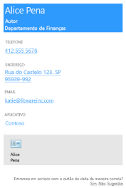
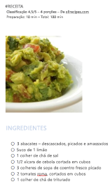
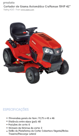

# <a name="use-onenote-api-div-tags-to-extract-data-from-captures"></a><span data-ttu-id="ad0a5-101">Usar marcas DIV da API do OneNote para extrair dados de capturas</span><span class="sxs-lookup"><span data-stu-id="ad0a5-101">Use OneNote API div tags to extract data from captures</span></span> 

<span data-ttu-id="ad0a5-102">*__Aplica-se a:__ Bloco de anotações dos consumidores no OneDrive | Bloco de anotações empresariais no Office 365*</span><span class="sxs-lookup"><span data-stu-id="ad0a5-102">*__Applies to:__ Consumer notebooks on OneDrive | Enterprise notebooks on Office 365*</span></span>

<span data-ttu-id="ad0a5-103">Use a API do OneNote para extrair dados do cartão de visitas de uma imagem ou dados de receita e produto de uma URL.</span><span class="sxs-lookup"><span data-stu-id="ad0a5-103">Use the OneNote API to extract business card data from an image, or recipe and product data from a URL.</span></span>

<a name="attributes"></a>
## <a name="extraction-attributes"></a><span data-ttu-id="ad0a5-104">Atributos de extração</span><span class="sxs-lookup"><span data-stu-id="ad0a5-104">Extraction attributes</span></span>

<span data-ttu-id="ad0a5-105">Para extrair e transformar dados, basta incluir um div que especifique o conteúdo de origem, o método de extração e o comportamento de fallback na sua solicitação [create-page](onenote-create-page.md) ou [update-page](onenote_update_page.md).</span><span class="sxs-lookup"><span data-stu-id="ad0a5-105">To extract and transform data, simply include a div that specifies the source content, extraction method, and fallback behavior in your [create-page](onenote-create-page.md) or [update-page](onenote_update_page.md) request.</span></span> <span data-ttu-id="ad0a5-106">A API processa dados extraídos da página em um formato que é fácil de ler.</span><span class="sxs-lookup"><span data-stu-id="ad0a5-106">The API renders extracted data on the page in an easy-to-read format.</span></span> 

```
<div
  data-render-src="image-or-url"
  data-render-method="extraction-method"
  data-render-fallback="fallback-action">
</div>
```

<span data-ttu-id="ad0a5-107">**data-render-src**</span><span class="sxs-lookup"><span data-stu-id="ad0a5-107">**data-render-src**</span></span>

<span data-ttu-id="ad0a5-108">A fonte de conteúdo.</span><span class="sxs-lookup"><span data-stu-id="ad0a5-108">The content source for the extraction.</span></span> <span data-ttu-id="ad0a5-109">Pode ser uma imagem de um cartão de visitas ou uma URL absoluta de muitos sites populares de receitas ou produtos.</span><span class="sxs-lookup"><span data-stu-id="ad0a5-109">This can be an image of a business card or an absolute URL from many popular recipe or product websites.</span></span> <span data-ttu-id="ad0a5-110">Obrigatório.</span><span class="sxs-lookup"><span data-stu-id="ad0a5-110">Required.</span></span>

<span data-ttu-id="ad0a5-111">Para obter melhores resultados ao especificar uma URL, use a URL canônica definida no HTML da página da Web de origem, caso houver uma URL definida.</span><span class="sxs-lookup"><span data-stu-id="ad0a5-111">For best results when specifying a URL, use the canonical URL defined in the HTML of the source webpage, if one is defined.</span></span> <span data-ttu-id="ad0a5-112">Por exemplo, uma URL canônica pode estar definida na página da Web de origem da seguinte forma:</span><span class="sxs-lookup"><span data-stu-id="ad0a5-112">For example, a canonical URL might be defined in the source webpage like this:</span></span>

`<link rel="canonical" href="www.domainname.com/page/123/size12/type987" />` 


<span data-ttu-id="ad0a5-113">**data-render-method**</span><span class="sxs-lookup"><span data-stu-id="ad0a5-113">**data-render-method**</span></span>

<span data-ttu-id="ad0a5-114">O método de extração a ser executado.</span><span class="sxs-lookup"><span data-stu-id="ad0a5-114">The extraction method to run.</span></span> <span data-ttu-id="ad0a5-115">Obrigatório.</span><span class="sxs-lookup"><span data-stu-id="ad0a5-115">Required.</span></span>

| <span data-ttu-id="ad0a5-116">Valor</span><span class="sxs-lookup"><span data-stu-id="ad0a5-116">Value</span></span> | <span data-ttu-id="ad0a5-117">Descrição</span><span class="sxs-lookup"><span data-stu-id="ad0a5-117">Description</span></span> |
|:------|:------|
| <span data-ttu-id="ad0a5-118">extract.businesscard</span><span class="sxs-lookup"><span data-stu-id="ad0a5-118">extract.businesscard</span></span> | <span data-ttu-id="ad0a5-119">A extração de um cartão de visita.</span><span class="sxs-lookup"><span data-stu-id="ad0a5-119">A business card extraction.</span></span> |
| <span data-ttu-id="ad0a5-120">extract.recipe</span><span class="sxs-lookup"><span data-stu-id="ad0a5-120">extract.recipe</span></span> | <span data-ttu-id="ad0a5-121">Uma extração de receita.</span><span class="sxs-lookup"><span data-stu-id="ad0a5-121">A recipe extraction.</span></span> |
| <span data-ttu-id="ad0a5-122">extract.product</span><span class="sxs-lookup"><span data-stu-id="ad0a5-122">extract.product</span></span> | <span data-ttu-id="ad0a5-123">A extração de uma lista de produtos.</span><span class="sxs-lookup"><span data-stu-id="ad0a5-123">A product listing extraction.</span></span> |
| <span data-ttu-id="ad0a5-124">extract</span><span class="sxs-lookup"><span data-stu-id="ad0a5-124">EXTRACT</span></span> | <span data-ttu-id="ad0a5-125">Um tipo de extração desconhecida.</span><span class="sxs-lookup"><span data-stu-id="ad0a5-125">An unknown extraction type.</span></span> |

<span data-ttu-id="ad0a5-126">Para obter melhores resultados, especifique o tipo de conteúdo (`extract.businesscard`, `extract.recipe` ou `extract.product`) se você conhecê-lo.</span><span class="sxs-lookup"><span data-stu-id="ad0a5-126">For best results, specify the content type (`extract.businesscard`, `extract.recipe`, or `extract.product`) if you know it.</span></span> <span data-ttu-id="ad0a5-127">Se o tipo for desconhecido, use o método `extract` e a API do OneNote tentará detectar o tipo automaticamente.</span><span class="sxs-lookup"><span data-stu-id="ad0a5-127">If the type is unknown, use the `extract` method and the OneNote API will try to auto-detect the type.</span></span>

<span data-ttu-id="ad0a5-128">**data-render-fallback**</span><span class="sxs-lookup"><span data-stu-id="ad0a5-128">**data-render-fallback**</span></span>

<span data-ttu-id="ad0a5-129">O comportamento de fallback se a extração falhar.</span><span class="sxs-lookup"><span data-stu-id="ad0a5-129">The fallback action if the extraction fails: render (default) or none.</span></span> <span data-ttu-id="ad0a5-130">Usa o padrão **renderizar** caso seja omitido.</span><span class="sxs-lookup"><span data-stu-id="ad0a5-130">Defaults to **render** if omitted.</span></span> 

| <span data-ttu-id="ad0a5-131">Valor</span><span class="sxs-lookup"><span data-stu-id="ad0a5-131">Value</span></span> | <span data-ttu-id="ad0a5-132">Descrição</span><span class="sxs-lookup"><span data-stu-id="ad0a5-132">Description</span></span> |
|:------|:------|
| <span data-ttu-id="ad0a5-133">render</span><span class="sxs-lookup"><span data-stu-id="ad0a5-133">render()</span></span> | <span data-ttu-id="ad0a5-134">Renderiza a imagem de origem ou um instantâneo da página do produto ou receita.</span><span class="sxs-lookup"><span data-stu-id="ad0a5-134">Renders the source image or a snapshot of the recipe or product webpage.</span></span> |
| <span data-ttu-id="ad0a5-135">nenhum</span><span class="sxs-lookup"><span data-stu-id="ad0a5-135">none</span></span> | <span data-ttu-id="ad0a5-136">Não faz nada.</span><span class="sxs-lookup"><span data-stu-id="ad0a5-136">Does nothing.</span></span><br /><span data-ttu-id="ad0a5-137">Essa opção é útil se você quiser sempre incluir um instantâneo do cartão de visitas ou da página da Web na página, além de outro conteúdo extraído.</span><span class="sxs-lookup"><span data-stu-id="ad0a5-137">This option is useful if you want to always include a snapshot of the business card or webpage on the page in addition to any extracted content.</span></span> <span data-ttu-id="ad0a5-138">Certifique-se enviar um elemento `img` separado na solicitação, conforme mostrado nos exemplos.</span><span class="sxs-lookup"><span data-stu-id="ad0a5-138">Be sure to send a separate `img` element in the request, as shown in the examples.</span></span> |

<a name="biz-card"></a>
## <a name="business-card-extractions"></a><span data-ttu-id="ad0a5-139">Extrações de cartões de visita</span><span class="sxs-lookup"><span data-stu-id="ad0a5-139">Business card extractions</span></span>

<span data-ttu-id="ad0a5-140">A API do OneNote tenta localizar e renderizar as seguintes informações de contato com base em uma imagem do cartão de visitas de uma pessoa ou empresa.</span><span class="sxs-lookup"><span data-stu-id="ad0a5-140">The OneNote API tries to find and render the following contact information based on an image of a person's or company's business card.</span></span>


- <span data-ttu-id="ad0a5-141">Nome</span><span class="sxs-lookup"><span data-stu-id="ad0a5-141">Name</span></span>
- <span data-ttu-id="ad0a5-142">Título</span><span class="sxs-lookup"><span data-stu-id="ad0a5-142">Title</span></span>
- <span data-ttu-id="ad0a5-143">Organização</span><span class="sxs-lookup"><span data-stu-id="ad0a5-143">organization</span></span>
- <span data-ttu-id="ad0a5-144">Números de telefone e fax</span><span class="sxs-lookup"><span data-stu-id="ad0a5-144">Phone and fax numbers</span></span>
- <span data-ttu-id="ad0a5-145">Endereços para correspondência e físicos</span><span class="sxs-lookup"><span data-stu-id="ad0a5-145">Mailing and physical addresses</span></span>
- <span data-ttu-id="ad0a5-146">Emails</span><span class="sxs-lookup"><span data-stu-id="ad0a5-146">Email addresses</span></span>
- <span data-ttu-id="ad0a5-147">Sites</span><span class="sxs-lookup"><span data-stu-id="ad0a5-147">websites</span></span>
   
  

<span data-ttu-id="ad0a5-149">Um vCard (arquivo .VCF) com as informações de contato extraídas também é incorporado na página.</span><span class="sxs-lookup"><span data-stu-id="ad0a5-149">A vCard (.VCF file) with the extracted contact information is also embedded in the page.</span></span> <span data-ttu-id="ad0a5-150">O vCard é uma maneira conveniente de obter as informações de contato ao recuperar o conteúdo HTML da página.</span><span class="sxs-lookup"><span data-stu-id="ad0a5-150">The vCard is a convenient way to get the contact information when retrieving page HTML content.</span></span>

### <a name="common-scenarios-for-business-card-extractions"></a><span data-ttu-id="ad0a5-151">Cenários comuns para extrações de cartões de visita</span><span class="sxs-lookup"><span data-stu-id="ad0a5-151">Common scenarios for business card extractions</span></span>

<span data-ttu-id="ad0a5-152">**Extrair informações do cartão de visitas e também renderizar a imagem do cartão de visitas**</span><span class="sxs-lookup"><span data-stu-id="ad0a5-152">**Extract business card information, and also render the business card image**</span></span>

<span data-ttu-id="ad0a5-153">Especifique o método `extract.businesscard` e o fallback `none`.</span><span class="sxs-lookup"><span data-stu-id="ad0a5-153">Specify the `extract.businesscard` method and the `none` fallback.</span></span> <span data-ttu-id="ad0a5-154">Envie também um elemento `img` com o atributo `src` que também faz referência à imagem.</span><span class="sxs-lookup"><span data-stu-id="ad0a5-154">Also send an `img` element with the `src` attribute that also references the image.</span></span> <span data-ttu-id="ad0a5-155">Se a API não conseguir extrair conteúdo, ela renderizará apenas a imagem do cartão de visita.</span><span class="sxs-lookup"><span data-stu-id="ad0a5-155">If the API is unable to extract any content, it renders the business card image only.</span></span>

```html 
<div
    data-render-src="name:scanned-card-image"
    data-render-method="extract.businesscard"
    data-render-fallback="none">
</div>

```


<span data-ttu-id="ad0a5-156">**Extrair informações do cartão de visitas e renderizar a imagem do cartão de visitas apenas se a extração falhar**</span><span class="sxs-lookup"><span data-stu-id="ad0a5-156">**Extract business card information, and render the business card image only if the extraction fails**</span></span>

<span data-ttu-id="ad0a5-157">Especifique o método `extract.businesscard` e use o fallback `render` padrão.</span><span class="sxs-lookup"><span data-stu-id="ad0a5-157">Specify the `extract.businesscard` method and use the default `render` fallback.</span></span> <span data-ttu-id="ad0a5-158">Se a API não conseguir extrair conteúdo, ela renderizará a imagem do cartão de visita.</span><span class="sxs-lookup"><span data-stu-id="ad0a5-158">If the API is unable to extract any content, it renders the business card image instead.</span></span>

```html
<div
    data-render-src="name:scanned-card-image"
    data-render-method="extract.businesscard">
</div>
```
 
<span data-ttu-id="ad0a5-159">Para extrações de cartão de visita, a imagem é enviada como uma parte nomeada em uma solicitação múltiplas.</span><span class="sxs-lookup"><span data-stu-id="ad0a5-159">For business card extractions, the image is sent as a named part in a multipart request.</span></span> <span data-ttu-id="ad0a5-160">Confira [Adicionar imagens e arquivos](onenote_images_files.md) para ver exemplos que mostram como enviar uma imagem em uma solicitação.</span><span class="sxs-lookup"><span data-stu-id="ad0a5-160">See [Add images and files](onenote_images_files.md) for examples that show how to send an image in a request.</span></span>


<a name="recipe"></a>
## <a name="recipe-extractions"></a><span data-ttu-id="ad0a5-161">Extrações receitas</span><span class="sxs-lookup"><span data-stu-id="ad0a5-161">Recipe extractions</span></span>

<span data-ttu-id="ad0a5-162">A API do OneNote tenta localizar e renderizar as seguintes informações com base na URL de uma receita.</span><span class="sxs-lookup"><span data-stu-id="ad0a5-162">The OneNote API tries to find and render the following information based on a recipe's URL.</span></span>

- <span data-ttu-id="ad0a5-163">Imagem Hero</span><span class="sxs-lookup"><span data-stu-id="ad0a5-163">Hero image</span></span>
- <span data-ttu-id="ad0a5-164">Classificação</span><span class="sxs-lookup"><span data-stu-id="ad0a5-164">Rating</span></span>
- <span data-ttu-id="ad0a5-165">Ingredientes</span><span class="sxs-lookup"><span data-stu-id="ad0a5-165">Ingredients</span></span>
- <span data-ttu-id="ad0a5-166">Instruções</span><span class="sxs-lookup"><span data-stu-id="ad0a5-166">Instructions</span></span>
- <span data-ttu-id="ad0a5-167">Preparação, instruções sobre como cozinhar e tempos totais</span><span class="sxs-lookup"><span data-stu-id="ad0a5-167">Prep, cook, and total times</span></span>
- <span data-ttu-id="ad0a5-168">Porções</span><span class="sxs-lookup"><span data-stu-id="ad0a5-168">Servings</span></span>

   

<span data-ttu-id="ad0a5-170">A API é otimizada para receitas de muitos sites populares, como *Allrecipes.com*, *FoodNetwork.com* e *SeriousEats.com*.</span><span class="sxs-lookup"><span data-stu-id="ad0a5-170">The API is optimized for recipes from many popular sites such as *Allrecipes.com*, *FoodNetwork.com*, and *SeriousEats.com*.</span></span>

### <a name="common-scenarios-for-recipe-extractions"></a><span data-ttu-id="ad0a5-171">Cenários comuns para extrações de receitas</span><span class="sxs-lookup"><span data-stu-id="ad0a5-171">Common scenarios for recipe extractions</span></span>

<span data-ttu-id="ad0a5-172">**Extrair informações da receita e também renderizar um instantâneo da página da receita**</span><span class="sxs-lookup"><span data-stu-id="ad0a5-172">**Extract recipe information, and also render a snapshot of the recipe webpage**</span></span>

<span data-ttu-id="ad0a5-173">Especifique o método `extract.recipe` e o fallback `none`.</span><span class="sxs-lookup"><span data-stu-id="ad0a5-173">Specify the `extract.recipe` method and the `none` fallback.</span></span> <span data-ttu-id="ad0a5-174">Envie também um elemento `img` com o atributo `data-render-src` definido como URL da receita.</span><span class="sxs-lookup"><span data-stu-id="ad0a5-174">Also send an `img` element with the `data-render-src` attribute set to the recipe URL.</span></span> <span data-ttu-id="ad0a5-175">Se a API não conseguir extrair conteúdo, ela renderizará apenas um instantâneo da página da Web da receita.</span><span class="sxs-lookup"><span data-stu-id="ad0a5-175">If the API is unable to extract any content, it renders a snapshot of the recipe webpage only.</span></span>

<span data-ttu-id="ad0a5-176">Este cenário potencialmente fornece mais informações porque a página da Web pode incluir informações adicionais, como comentários e sugestões de clientes.</span><span class="sxs-lookup"><span data-stu-id="ad0a5-176">This scenario potentially provides the most information because the webpage may include additional information, such as customer reviews and suggestions.</span></span>

```html 
<div
    data-render-src="http://allrecipes.com/recipe/guacamole/"
    data-render-method="extract.recipe"
    data-render-fallback="none">
</div>

```
 

<span data-ttu-id="ad0a5-177">**Extrair informações da receita e renderizar um instantâneo da página da receita apenas se a extração falhar**</span><span class="sxs-lookup"><span data-stu-id="ad0a5-177">**Extract recipe information, and render a snapshot of the recipe webpage only if the extraction fails**</span></span>

<span data-ttu-id="ad0a5-178">Especifique o método `extract.recipe` e use o fallback de renderização padrão.</span><span class="sxs-lookup"><span data-stu-id="ad0a5-178">Specify the `extract.recipe` method and use the default render fallback.</span></span> <span data-ttu-id="ad0a5-179">Se a API não conseguir extrair conteúdo, ela renderizará um instantâneo da página da Web da receita.</span><span class="sxs-lookup"><span data-stu-id="ad0a5-179">If the API is unable to extract any content, it renders a snapshot of the recipe webpage instead.</span></span>

```html  
<div
    data-render-src="http://www.foodnetwork.com/recipes/alton-brown/creme-brulee-recipe.html"
    data-render-method="extract.recipe">
</div>
```


<span data-ttu-id="ad0a5-180">**Extrair informações da receita e também renderizar um link para a receita**</span><span class="sxs-lookup"><span data-stu-id="ad0a5-180">**Extract recipe information, and also render a link to the recipe**</span></span>

<span data-ttu-id="ad0a5-181">Especifique o método `extract.recipe` e o fallback `none`.</span><span class="sxs-lookup"><span data-stu-id="ad0a5-181">Specify the `extract.recipe` method and the `none` fallback.</span></span> <span data-ttu-id="ad0a5-182">Envie também um elemento `a` com o atributo `src` definido com a URL da receita (ou você pode enviar qualquer outra informação que queira adicionar à página).</span><span class="sxs-lookup"><span data-stu-id="ad0a5-182">Also send an `a` element with the `src` attribute set to the recipe URL (or you can send any other information you want to add to the page).</span></span> <span data-ttu-id="ad0a5-183">Se a API não conseguir extrair conteúdo, apenas o link da receita será renderizado.</span><span class="sxs-lookup"><span data-stu-id="ad0a5-183">If the API is unable to extract any content, only the recipe link is rendered.</span></span>

```html  
<div
    data-render-src="http://www.seriouseats.com/recipes/2014/09/diy-spicy-kimchi-beef-instant-noodles-recipe.html"
    data-render-method="extract.recipe"
    data-render-fallback="none">
</div>
<a href="http://www.seriouseats.com/recipes/2014/09/diy-spicy-kimchi-beef-instant-noodles-recipe.html">Recipe URL</a>
``` 


<a name="product"></a>
## <a name="product-listing-extractions"></a><span data-ttu-id="ad0a5-184">Extrações da lista de produtos</span><span class="sxs-lookup"><span data-stu-id="ad0a5-184">Product listing extractions</span></span>

- <span data-ttu-id="ad0a5-185">Título</span><span class="sxs-lookup"><span data-stu-id="ad0a5-185">Title</span></span>
- <span data-ttu-id="ad0a5-186">Classificação</span><span class="sxs-lookup"><span data-stu-id="ad0a5-186">Rating</span></span>
- <span data-ttu-id="ad0a5-187">Imagem principal</span><span class="sxs-lookup"><span data-stu-id="ad0a5-187">Primary button image</span></span>
- <span data-ttu-id="ad0a5-188">Descrição</span><span class="sxs-lookup"><span data-stu-id="ad0a5-188">Description</span></span>
- <span data-ttu-id="ad0a5-189">Recursos</span><span class="sxs-lookup"><span data-stu-id="ad0a5-189">Features</span></span>
- <span data-ttu-id="ad0a5-190">Especificações</span><span class="sxs-lookup"><span data-stu-id="ad0a5-190">Format Specifications</span></span></td>

  

<span data-ttu-id="ad0a5-192">A API é otimizada para produtos de muitos sites populares, como *Amazon.com* e *HomeDepot.com*.</span><span class="sxs-lookup"><span data-stu-id="ad0a5-192">The API is optimized for products from many popular sites such as *Amazon.com* and *HomeDepot.com*.</span></span>

### <a name="common-scenarios-for-recipe-extractions"></a><span data-ttu-id="ad0a5-193">Cenários comuns para extrações de receitas</span><span class="sxs-lookup"><span data-stu-id="ad0a5-193">Common scenarios for recipe extractions</span></span>

<span data-ttu-id="ad0a5-194">**Extrair informações do produto e também renderizar um instantâneo da página da Web do produto**</span><span class="sxs-lookup"><span data-stu-id="ad0a5-194">**Extract product information, and also render a snapshot of the product webpage**</span></span>

<span data-ttu-id="ad0a5-195">Especifique o método `extract.product` e o fallback `none`.</span><span class="sxs-lookup"><span data-stu-id="ad0a5-195">Specify the `extract.product` method and the `none` fallback.</span></span> <span data-ttu-id="ad0a5-196">Envie também um elemento `img` com o atributo `data-render-src` definido como URL do produto.</span><span class="sxs-lookup"><span data-stu-id="ad0a5-196">Also send an `img` element with the `data-render-src` attribute set to the product URL.</span></span> <span data-ttu-id="ad0a5-197">Se a API não conseguir extrair conteúdo, ela renderizará apenas um instantâneo da página da Web do produto.</span><span class="sxs-lookup"><span data-stu-id="ad0a5-197">If the API is unable to extract any content, it renders a snapshot of the product webpage only.</span></span>

<span data-ttu-id="ad0a5-198">Este cenário potencialmente fornece mais informações porque a página da Web pode incluir informações adicionais, como comentários e sugestões de clientes.</span><span class="sxs-lookup"><span data-stu-id="ad0a5-198">This scenario potentially provides the most information because the webpage may include additional information, such as customer reviews and suggestions.</span></span>

```html 
<div
    data-render-src="http://www.amazon.com/Microsoft-Band-Small/dp/B00P2T2WVO"
    data-render-method="extract.product"
    data-render-fallback="none">
</div>

```


<span data-ttu-id="ad0a5-199">**Extrair informações do produto e renderizar um instantâneo da página do produto apenas se a extração falhar**</span><span class="sxs-lookup"><span data-stu-id="ad0a5-199">**Extract product information, and render a snapshot of the product webpage only if the extraction fails**</span></span>

<span data-ttu-id="ad0a5-200">Especifique o método `extract.product` e use o fallback de renderização padrão.</span><span class="sxs-lookup"><span data-stu-id="ad0a5-200">Specify the `extract.product` method and use the default render fallback.</span></span> <span data-ttu-id="ad0a5-201">Se a API não conseguir extrair conteúdo, ela renderizará um instantâneo da página da Web do produto.</span><span class="sxs-lookup"><span data-stu-id="ad0a5-201">If the API is unable to extract any content, it renders a snapshot of the product webpage instead.</span></span>

```html 
<div
    data-render-src="http://www.sears.com/craftsman-19hp-42-8221-turn-tight-174-hydrostatic-yard-tractor/p-07120381000P"
    data-render-method="extract.product">
</div>
```
 

<span data-ttu-id="ad0a5-202">**Extrair informações do produto e também renderizar um link para o produto**</span><span class="sxs-lookup"><span data-stu-id="ad0a5-202">**Extract product information, and also render a link to the product**</span></span>

<span data-ttu-id="ad0a5-203">Especifique o método `extract.product` e o fallback `none`.</span><span class="sxs-lookup"><span data-stu-id="ad0a5-203">Specify the `extract.product` method and the `none` fallback.</span></span> <span data-ttu-id="ad0a5-204">Envie também um elemento `a` com o atributo `src` definido com a URL do produto (ou você pode enviar qualquer outra informação que queira adicionar à página).</span><span class="sxs-lookup"><span data-stu-id="ad0a5-204">Also send an `a` element with the `src` attribute set to the product URL (or you can send any other information you want to add to the page).</span></span> <span data-ttu-id="ad0a5-205">Se a API não conseguir extrair conteúdo, apenas o link da página será renderizado.</span><span class="sxs-lookup"><span data-stu-id="ad0a5-205">If the API is unable to extract any content, only the page link is rendered.</span></span>

```html 
<div
    data-render-src="http://www.homedepot.com/p/Active-Ventilation-5-Watt-Solar-Powered-Exhaust-Attic-Fan-RBSF-8-WT/204203001"
    data-render-method="extract.product"
    data-render-fallback="none">
</div>
<a href="http://www.homedepot.com/p/Active-Ventilation-5-Watt-Solar-Powered-Exhaust-Attic-Fan-RBSF-8-WT/204203001">Product URL</a>
```


<a name="unknown"></a> 
## <a name="unknown-content-type-extractions"></a><span data-ttu-id="ad0a5-206">Extrações de tipos de conteúdo desconhecidos</span><span class="sxs-lookup"><span data-stu-id="ad0a5-206">Unknown content type extractions</span></span>

<span data-ttu-id="ad0a5-207">Se você não souber o tipo de conteúdo (cartão de visita, receita ou produto) que está enviando, poderá usar o método não qualificado `extract` e permitir que a API do OneNote detecte automaticamente o tipo.</span><span class="sxs-lookup"><span data-stu-id="ad0a5-207">If you don't know the content type (business card, recipe, or product) that you're sending, you can use the unqualified `extract` method and let the OneNote API automatically detect the type.</span></span> <span data-ttu-id="ad0a5-208">É provável que você queira fazer isso se seu aplicativo enviar diferentes tipos de captura.</span><span class="sxs-lookup"><span data-stu-id="ad0a5-208">You might want to do this if your app sends different capture types.</span></span>

> <span data-ttu-id="ad0a5-209">**Observação:** se você souber o tipo de conteúdo que está enviando, use o método `extract.businesscard`, `extract.recipe` ou `extract.product`.</span><span class="sxs-lookup"><span data-stu-id="ad0a5-209">**Note:** If you do know the content type that you're sending, you should use the `extract.businesscard`, `extract.recipe`, or `extract.product` method.</span></span> <span data-ttu-id="ad0a5-210">Em alguns casos, isso pode ajudar a otimizar os resultados da extração.</span><span class="sxs-lookup"><span data-stu-id="ad0a5-210">In some cases, this can help to optimize the extraction results.</span></span>
 
### <a name="common-scenarios-for-unknown-extractions"></a><span data-ttu-id="ad0a5-211">Cenários comuns para extrações desconhecidas</span><span class="sxs-lookup"><span data-stu-id="ad0a5-211">Common scenarios for unknown extractions</span></span>

<span data-ttu-id="ad0a5-212">**Enviar uma imagem ou uma URL e renderizar a imagem fornecida ou um instantâneo da página da Web se a extração falhar**</span><span class="sxs-lookup"><span data-stu-id="ad0a5-212">**Send an image or a URL, and render the supplied image or a snapshot of the webpage if the extraction fails**</span></span>

<span data-ttu-id="ad0a5-213">Especifique o método `extract` para que a API detecte automaticamente o tipo de conteúdo e use o fallback de renderização padrão.</span><span class="sxs-lookup"><span data-stu-id="ad0a5-213">Specify the `extract` method so the API automatically detects the content type, and use the default render fallback.</span></span> <span data-ttu-id="ad0a5-214">Se a API não conseguir extrair conteúdo, ela renderizará a imagem fornecida ou o instantâneo da página da Web.</span><span class="sxs-lookup"><span data-stu-id="ad0a5-214">If the API is unable to extract any content, it renders the supplied image or snapshot of the webpage instead.</span></span>

```html 
<div
    data-render-src="some image or url"
    data-render-method="extract">
</div>
```


<a name="request-response-info"></a>
## <a name="response-information"></a><span data-ttu-id="ad0a5-215">Informações de resposta</span><span class="sxs-lookup"><span data-stu-id="ad0a5-215">Response information</span></span>

| <span data-ttu-id="ad0a5-216">Dados de resposta</span><span class="sxs-lookup"><span data-stu-id="ad0a5-216">Response data</span></span> | <span data-ttu-id="ad0a5-217">Descrição</span><span class="sxs-lookup"><span data-stu-id="ad0a5-217">Description</span></span> |  
|------|------|  
| <span data-ttu-id="ad0a5-218">Código de êxito</span><span class="sxs-lookup"><span data-stu-id="ad0a5-218">Success code</span></span> | <span data-ttu-id="ad0a5-219">Um código de status HTTP 201 para uma solicitação POST bem-sucedida e um código de status HTTP 204 para uma solicitação PATCH bem-sucedida.</span><span class="sxs-lookup"><span data-stu-id="ad0a5-219">A 201 HTTP status code for a successful POST request, and a 204 HTTP status code for a successful PATCH request.</span></span> |  
| <span data-ttu-id="ad0a5-220">Erros</span><span class="sxs-lookup"><span data-stu-id="ad0a5-220">Errors</span></span>| <span data-ttu-id="ad0a5-221">Leia [Códigos de erro para APIs do OneNote no Microsoft Graph](onenote_error_codes.md) para saber mais sobre erros do OneNote que poderão ser retornados pelo Microsoft Graph.</span><span class="sxs-lookup"><span data-stu-id="ad0a5-221">Read [Error codes for OneNote APIs in Microsoft Graph](onenote_error_codes.md) to learn about OneNote errors that Microsoft Graph can return.</span></span> |  


<a name="permissions"></a>
## <a name="permissions"></a><span data-ttu-id="ad0a5-222">Permissões</span><span class="sxs-lookup"><span data-stu-id="ad0a5-222">Permissions</span></span>

<span data-ttu-id="ad0a5-223">Para criar ou atualizar páginas do OneNote, solicite permissões apropriadas.</span><span class="sxs-lookup"><span data-stu-id="ad0a5-223">To create or update OneNote pages, you'll need to request appropriate permissions.</span></span> <span data-ttu-id="ad0a5-224">Escolha o nível mais baixo de permissões que seu aplicativo precisa para realizar o trabalho.</span><span class="sxs-lookup"><span data-stu-id="ad0a5-224">Choose the lowest level of permissions that your app needs to do its work.</span></span>

<span data-ttu-id="ad0a5-225">**Permissões para _páginas POST_**</span><span class="sxs-lookup"><span data-stu-id="ad0a5-225">**Permissions for _POST pages_**</span></span>

- <span data-ttu-id="ad0a5-226">Notes.Create</span><span class="sxs-lookup"><span data-stu-id="ad0a5-226">Notes.Create</span></span>
- <span data-ttu-id="ad0a5-227">Notes.ReadWrite</span><span class="sxs-lookup"><span data-stu-id="ad0a5-227">Notes.ReadWrite</span></span>
- <span data-ttu-id="ad0a5-228">Notes.ReadWrite.All</span><span class="sxs-lookup"><span data-stu-id="ad0a5-228">Notes.ReadWrite.All</span></span>  

<span data-ttu-id="ad0a5-229">**Permissões para _páginas PATCH_**</span><span class="sxs-lookup"><span data-stu-id="ad0a5-229">**Permissions for _PATCH pages_**</span></span>

- <span data-ttu-id="ad0a5-230">Notes.ReadWrite</span><span class="sxs-lookup"><span data-stu-id="ad0a5-230">Notes.ReadWrite</span></span>
- <span data-ttu-id="ad0a5-231">Notes.ReadWrite.All</span><span class="sxs-lookup"><span data-stu-id="ad0a5-231">Notes.ReadWrite.All</span></span>

<span data-ttu-id="ad0a5-232">Para saber mais sobre escopos de permissão e como eles funcionam, confira [Referência de permissões do Microsoft Graph](permissions_reference.md).</span><span class="sxs-lookup"><span data-stu-id="ad0a5-232">For more information about permission scopes and how they work, see [Microsoft Graph permissions reference](permissions_reference.md).</span></span>


<a name="see-also"></a>
## <a name="additional-resources"></a><span data-ttu-id="ad0a5-233">Recursos adicionais</span><span class="sxs-lookup"><span data-stu-id="ad0a5-233">Additional resources</span></span>

- [<span data-ttu-id="ad0a5-234">Criar páginas do OneNote</span><span class="sxs-lookup"><span data-stu-id="ad0a5-234">Create OneNote pages</span></span>](onenote-create-page.md)
- [<span data-ttu-id="ad0a5-235">Atualizar o conteúdo da página do OneNote</span><span class="sxs-lookup"><span data-stu-id="ad0a5-235">Update OneNote page content</span></span>](onenote_update_page.md)
- [<span data-ttu-id="ad0a5-236">Adicionar imagens e arquivos</span><span class="sxs-lookup"><span data-stu-id="ad0a5-236">Add images and files</span></span>](onenote_images_files.md)
- [<span data-ttu-id="ad0a5-237">Integrar com o OneNote</span><span class="sxs-lookup"><span data-stu-id="ad0a5-237">Integrate with OneNote</span></span>](integrate_with_onenote.md)
- [<span data-ttu-id="ad0a5-238">Blog de desenvolvedor do OneNote</span><span class="sxs-lookup"><span data-stu-id="ad0a5-238">OneNote Developer Blog</span></span>](http://go.microsoft.com/fwlink/?LinkID=390183)
- [<span data-ttu-id="ad0a5-239">Perguntas sobre desenvolvimento do OneNote no Stack Overflow</span><span class="sxs-lookup"><span data-stu-id="ad0a5-239">OneNote development questions on Stack Overflow</span></span>](http://go.microsoft.com/fwlink/?LinkID=390182)
- [<span data-ttu-id="ad0a5-240">Repositórios do OneNote no GitHub</span><span class="sxs-lookup"><span data-stu-id="ad0a5-240">OneNote GitHub repos</span></span>](http://go.microsoft.com/fwlink/?LinkID=390178)  

