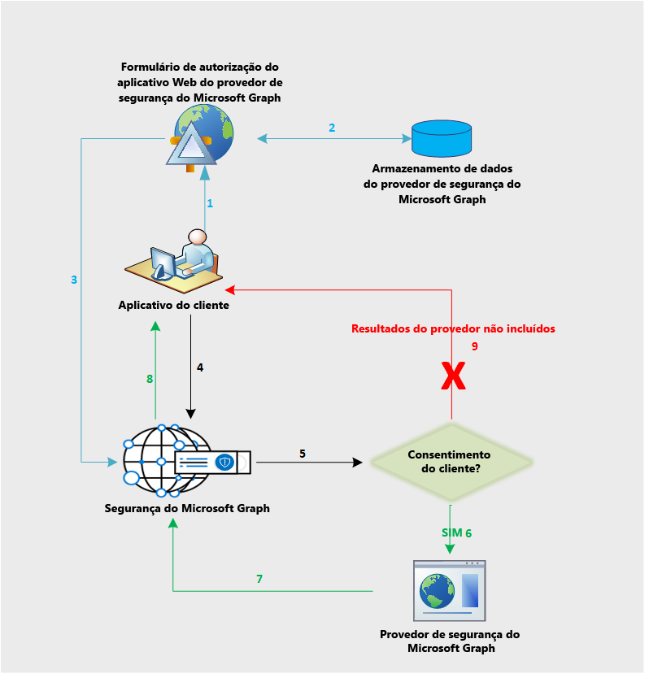

# Fluxo de dados de API de segurança do Microsoft Graph

A API de segurança do Microsoft Graph agrupa solicitações para todos os provedores no ecossistema do Microsoft Graph Security. Isso se baseia no consentimento de provedor de segurança fornecido pelo aplicativo, conforme mostrado no diagrama a seguir. O fluxo de trabalho de consentimento só se aplica a provedores de não-Microsoft.

A seguir está uma descrição do fluxo de:

1. O usuário do aplicativo entra no aplicativo do provedor para exibir o formulário de consentimento do provedor. Esta experiência de formulário de consentimento ou a interface do usuário pertence pelo provedor e aplica a provedores de não-Microsoft apenas para obter o consentimento explícito dos seus clientes para enviar solicitações a API de segurança do Microsoft Graph.
2. O consentimento de cliente é armazenado no lado do provedor.
3. O provedor de consentimento chamadas de serviço a API de segurança do Microsoft Graph para informar a aprovação de consentimento para o respectivo cliente.
4. O aplicativo envia uma solicitação para a API de segurança do Microsoft Graph.
5. A API de segurança do Microsoft Graph verifica as informações de consentimento para este cliente mapeada para vários provedores.
6. A API de segurança do Microsoft Graph chama todos os provedores que o cliente tiver dado consentimento explícito via o consentimento de provedor experimentarem.
7. A resposta é retornada de todos os provedores consentidos para que o cliente.
8. A resposta do conjunto de resultados é retornada para o aplicativo.
9. Se o cliente não aceitou qualquer provedor, nenhum resultado desses provedores está incluído na resposta.
