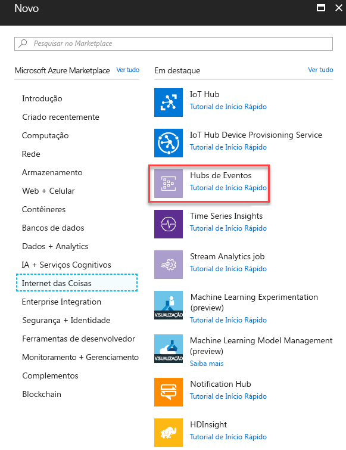
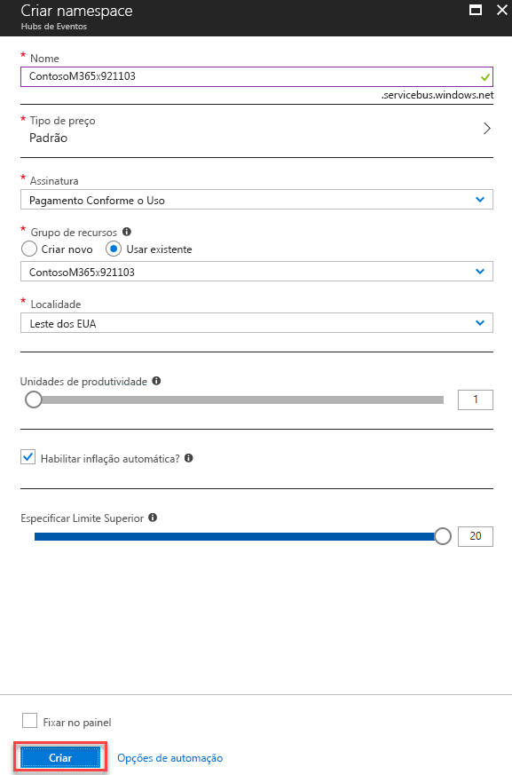

# <a name="integrate-microsoft-graph-security-api-alerts-with-ibm-qradar-siem-using-azure-monitor"></a>Integre os alertas de API de segurança do Microsoft Graph SIEM do IBM QRadar usando o Monitor do Azure

Os provedores de segurança do Microsoft Graph podem ser gerenciados por meio de um único ponto de extremidade do REST. Neste ponto de extremidade pode ser configurado para [Monitorar do Azure](https://docs.microsoft.com/en-us/azure/monitoring-and-diagnostics/), que oferece suporte a conectores para vários produtos SIEM. As instruções nas etapas 1 e 2 deste artigo se referir a todos os conectores do Monitor do Azure que dão suporte ao consumo via hubs de evento. Este artigo descreve a integração de ponta a ponta do conector [QRadar](https://www.ibm.com/us-en/marketplace/ibm-qradar-siem) SIEM.

O processo de integração envolve as seguintes etapas:

1. [Configurar o hub de evento do Windows Azure para receber alertas de segurança para o seu locatário](#step-1-set-up-an-event-hubs-namespace-in-azure-to-receive-security-alerts-for-your-tenant).
2. [Configurar o Azure Monitor para enviar alertas de segurança de seu locatário do hub do evento](#step-2-configure-azure-monitor-to-send-security-alerts-from-your-tenant-to-the-event-hub).
3. [Baixe e instale o QRadar para consumir os alertas de segurança](#step-3-download-and-install-the-qradar-to-consume-security-alerts).

Após concluir essas etapas, seu IBM QRadar consumirá alertas de segurança de todos os produtos de segurança para o qual seu locatário é licenciado integrado do Microsoft Graph. Todos os novos produtos de segurança que você licenciar também enviarão alertas por essa conexão, no mesmo esquema sem qualquer trabalho de integração adicional necessário.

## <a name="step-1-set-up-an-event-hubs-namespace-in-azure-to-receive-security-alerts-for-your-tenant"></a>Etapa 1: definir um namespace para o Hub de Eventos no Azure para receber alertas de segurança do locatário

Para começar, você precisará criar um hub de namespace e eventos do [Microsoft Azure evento Hubs](https://docs.microsoft.com/en-us/azure/event-hubs/) . Esse hub de eventos e namespace serão o destino de todos os alertas de segurança da organização. Um namespace do Hub de Eventos é um agrupamento lógico de hubs de eventos que compartilham a mesma política de acesso. Observe alguns detalhes importantes sobre o namespace e os hubs de eventos dos Hubs de Eventos criados por você:

- É recomendável usar um namespace para os Hubs de Eventos Padrão, especialmente se você estiver enviando outros dados de monitoramento do Azure por esses mesmos hubs de eventos.
- Normalmente, apenas uma unidade de taxa de transferência é necessária. Se uma ampliação é necessária à medida que a utilização aumenta, é possível aumentar manualmente a quantidade de unidades de taxa de transferência do namespace posteriormente ou habilitar a inflação automática.
- A quantidade de unidades de taxa de transferência permite aumentar a escala de produtividade dos hubs de eventos. A quantidade de partições permite colocar em paralelo o consumo em vários clientes. Uma única partição pode alcançar até 20 MB por segundo, ou aproximadamente 20 mil mensagens por segundo. Dependendo da ferramenta de consumo de dados, o consumo de várias partições pode ser compatível. Se você não tem certeza da quantidade de partições a definir, recomendamos começar com quatro partições.
- Recomendamos definir a retenção de mensagem no hub de eventos para sete dias. Se a ferramenta de consumo falhar por mais de um dia, isso garantirá que ela poderá retomar de onde parou (para eventos de até 7 dias).
- Recomendamos o uso do grupo de consumidores padrão para o hub de eventos. Não é necessário criar outros grupos de consumidores ou usar um grupo de consumidores separado, a menos que você pretenda que duas ferramentas diferentes consumam os mesmos dados do mesmo hub de eventos.
- Normalmente, as portas 5671 e 5672 devem estar abertas no computador que consome os dados do hub de eventos.

Veja também as [Perguntas frequentes do Hub de Eventos do Azure](https://docs.microsoft.com/en-us/azure/event-hubs/event-hubs-faq).

1. Faça logon no [portal do Azure](https://portal.azure.com/) e escolha **Criar um recurso** na parte superior esquerda da tela.

    

2. Selecione **Internet das coisas** e **Hubs de Eventos**.

    

3. Em **Criar um namespace**, insira um nome para o namespace. Após confirmar que o nome do namespace está disponível, escolha a faixa de preço (Básico ou Padrão). Escolha também uma assinatura do Azure, o grupo de recursos e o local no qual deseja criar o recurso. Escolha **Criar** para criar o namespace. Pode ser preciso esperar alguns minutos para que o sistema provisione totalmente os recursos.

    

## <a name="step-2-configure-azure-monitor-to-send-security-alerts-from-your-tenant-to-the-event-hub"></a>Etapa 2: configurar o Azure Monitor para enviar alertas de segurança do locatário para o hub de eventos

A habilitação do streaming dos alertas de segurança da organização pelo Azure Monitor é feita uma vez para todo o locatário do Azure Active Directory (Azure AD). Todas as API de segurança do Microsoft Graph licenciado e produtos habilitados começará a enviar alertas de segurança para monitorar o Azure, streaming de dados para consumir os aplicativos. Qualquer habilitados na API de segurança do Microsoft Graph produtos adicionais licenciado e implantado pela sua organização irá transmitir automaticamente os alertas de segurança por meio dessa mesma configuração Monitor do Azure. Nenhum trabalho adicional de integração é necessário por parte da organização.

Os alertas de segurança são dados altamente privilegiados, normalmente visíveis apenas pelas equipes de resposta de segurança e administradores globais de uma organização. Por esse motivo, as etapas necessárias para configurar a integração dos alertas de segurança do locatário com os sistemas SIEM exigem uma conta de Administrador Global do Azure AD. Essa conta só é necessária uma única vez, durante a instalação, para solicitação do envio dos alertas de segurança da sua organização ao Azure Monitor.

> **Observação:** Atualmente, o diagnóstico do Azure Monitor blade configurações não oferece suporte a configuração de recursos de nível de locatário. Alertas de API de segurança do Microsoft Graph são um recurso de nível de locatário, que requer usando a API de gerente de recursos do Windows Azure para configurar o Azure Monitor para suportar o consumo de alertas de segurança da sua organização.

1. Na sua assinatura do Windows Azure (pode ser encontrado em "Todos os serviços"), registre "microsoft.insights" (Azure Monitor) como um provedor de recursos.  
 > **Observação:** Não registre "Microsoft.SecurityGraph" (API de segurança do Microsoft Graph) como um provedor de recursos em sua assinatura do Windows Azure, como "Microsoft.SecurityGraph" é um recurso de nível de locatário, conforme explicado acima. Configuração de nível de locatário fará parte do nº 6 abaixo.

2. Para configurar o Azure Monitor usando a API Azure Resource Manager, obtenha a ferramenta [ARMClient](https://github.com/projectkudu/ARMClient). Ela será usada para enviar chamadas da API REST para o portal do Azure de uma linha de comando.

3. Prepare um arquivo JSON de solicitação de configuração de diagnóstico como este:

    ``` json
    {
      "location": "",
      "properties": {
        "name": "securityApiAlerts",
        "serviceBusRuleId": "/subscriptions/SUBSCRIPTION_ID/resourceGroups/RESOURCE_GROUP/providers/Microsoft.EventHub/namespaces/EVENT_HUB_NAMESPACE/authorizationrules/RootManageSharedAccessKey",
        "logs": [
          {
            "category": "Alert",
            "enabled": true,
            "retentionPolicy": {
              "enabled": true,
              "days": 7
            }
          }
        ]
      }
    }
    ```

  Substitua os valores no arquivo JSON da seguinte maneira:

  * **SUBSCRIPTION_ID** é a ID de assinatura do Azure que hospeda o grupo de recursos e o namespace do hub de eventos para onde você enviará os alertas de segurança da organização.
  * **RESOURCE_GROUP** é o grupo de recursos que contém o namespace do hub de eventos para onde você enviará os alertas de segurança da organização.
  * **EVENT_HUB_NAMESPACE** é o namespace do hub de eventos para onde você enviará os alertas de segurança da organização.
  * **"dias":** é o número de dias que deseja reter as mensagens no seu hub de evento.
  
&nbsp;

4. Salve o arquivo como JSON no diretório onde você vai usar o ARMClient.exe. Por exemplo, chame o arquivo de **AzMonConfig.json.**

5. Execute o seguinte comando para entrar na ferramenta ARMClient. Você precisará usar credenciais da conta de Administrador Global.

    ``` shell
    ARMClient.exe login
    ```

6. Execute o comando a seguir para configurar o envio de alertas de segurança pelo Azure Monitor para o namespace do hub de eventos. Isso provisionará automaticamente um hub de eventos no namespace e iniciará o fluxo de alertas de segurança no hub de eventos. O nome da configuração (neste exemplo, **securityApiAlerts**) deve corresponder ao nome da configuração especificado no arquivo JSON para o campo **name**.

    ``` shell
    ARMClient.exe put https://management.azure.com/providers/Microsoft.SecurityGraph/diagnosticSettings/securityApiAlerts?api-version=2017-04-01-preview  @".\AzMonConfig.json"
    ```

7. Para verificar a aplicação correta das configurações, execute este comando e confirme que a saída corresponde às configurações do arquivo JSON.

    ``` shell
    ARMClient.exe get https://management.azure.com/providers/Microsoft.SecurityGraph/diagnosticSettings/securityApiAlerts?api-version=2017-04-01-preview
    ```

8. Saia da ferramenta ARMClient. Você concluiu a configuração do Azure Monitor para o envio de alertas de segurança do locatário para hub de eventos.

## <a name="step-3-download-and-install-the-qradar-to-consume-security-alerts"></a>Etapa 3: Baixe e instale o QRadar para consumir os alertas de segurança

1. Baixe e instale o [IBM QRadar](https://www.ibm.com/us-en/marketplace/ibm-qradar-siem). A **versão 7.2.8 com Patch 7 ou superior é necessária** para ler eventos de um Hub de evento do Microsoft Azure.
2. Siga as etapas em [Configurando o Microsoft Azure evento Hubs para se comunicar com IBM QRadar](https://www.ibm.com/support/knowledgecenter/SS42VS_DSM/t_dsm_guide_microsoft_azure_enable_event_hubs.html) para configurar seu hub de evento.
3. Finalmente, siga as etapas em [Configurando QRadar para coletar eventos do Microsoft Azure evento Hubs usando o protocolo do Microsoft Azure evento Hubs](https://www.ibm.com/support/knowledgecenter/SS42VS_DSM/t_logsource_microsoft_azure_event_hubs.html) para começar o meio da exibição de alertas de segurança.
  
 > **Observação:** Integração do Microsoft Azure com IBM QRadar suporta os eventos listados na [Microsoft Azure DSM especificações](https://www.ibm.com/support/knowledgecenter/SS42VS_DSM/c_dsm_guide_microsoft_azure_DSM_specs.html). Estamos atualmente trabalhando com IBM QRadar para adicionar suporte completo para alertas de API de segurança do Microsoft Graph. Atualmente, você será capaz de receber os alertas de API do Microsoft Security gráfico e exibi-los no seu console IBM QRadar. Você pode usar o [editor de DSM](https://www.ibm.com/support/knowledgecenter/SS42VS_7.2.8/com.ibm.qradar.doc/c_qradar_adm_dsm_ed_overview.html) para habilitar os alertas de API do Microsoft Security gráfico de análise.  
