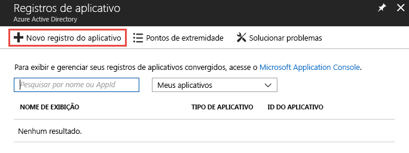
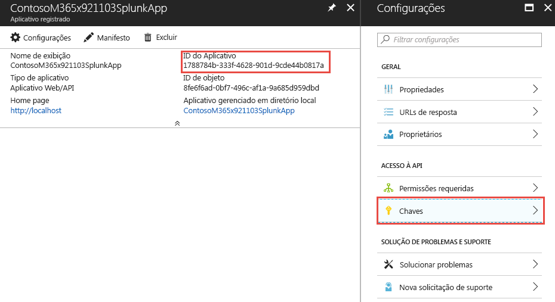
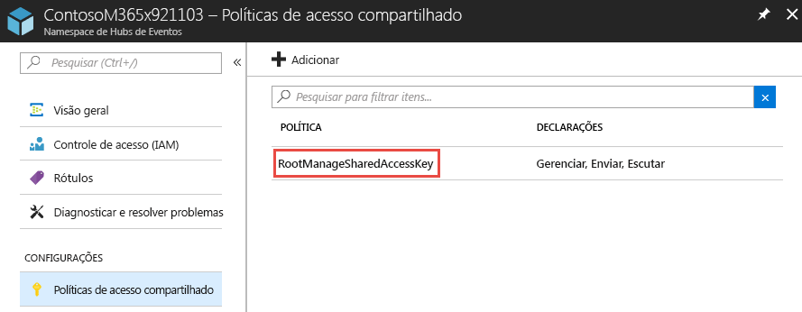
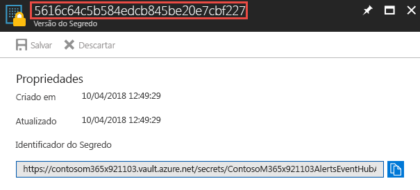
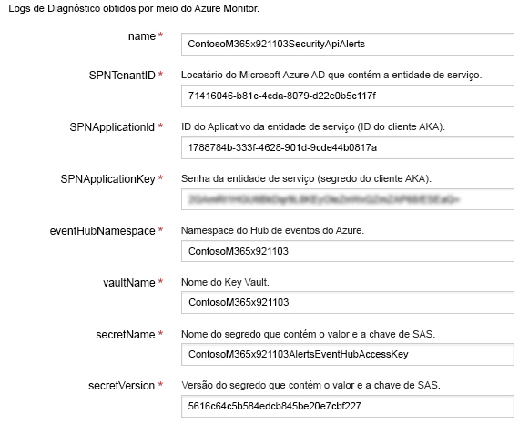
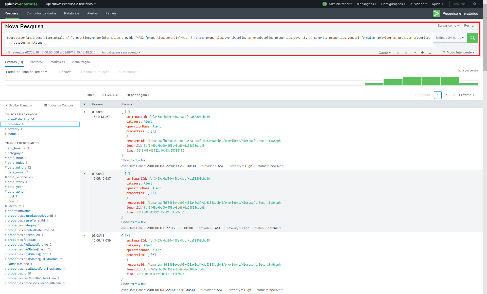

# <a name="integrate-microsoft-graph-security-api-alerts-with-your-siem-using-azure-monitor"></a>Integração dos alertas da API de Segurança do Microsoft Graph com o SIEM usando o Azure Monitor

Os provedores de Segurança do Microsoft Graph podem ser gerenciados por meio de um único ponto de extremidade REST. Este ponto de extremidade pode ser configurado para o [Azure Monitor](https://docs.microsoft.com/pt-BR/azure/monitoring-and-diagnostics/), que dá suporte a conectores para vários produtos SIEM. As instruções nas etapas 1 e 2 deste artigo referem-se a todos os conectores do Azure Monitor compatíveis com o consumo por Hubs de Eventos. Este artigo descreve a integração de ponta a ponta do conector [Splunk](https://splunkbase.splunk.com/) SIEM.

O processo de integração envolve as seguintes etapas:

1. [Configurar o Hub de Eventos do Azure para receber alertas de segurança para o locatário](#step-1-set-up-an-event-hubs-namespace-in-azure-to-receive-security-alerts-for-your-tenant)
2. [Configurar o Azure Monitor para enviar alertas de segurança do locatário para o Hub de Eventos](#step-2-configure-azure-monitor-to-send-security-alerts-from-your-tenant-to-the-event-hub)
3. [Baixar e instalar o complemento do Azure Monitor para o Splunk permitindo a este consumir alertas de segurança](#step-3-download-and-install-the-azure-monitor-add-on-for-splunk-which-will-allow-splunk-to-consume-security-alerts)
4. [Registrar um aplicativo com o locatário do Azure Active Directory que o Splunk usará para fazer leitura no hub de eventos](#step-4-register-an-application-with-your-tenant-azure-active-directory-which-splunk-will-use-to-read-from-the-event-hub )
5. [Criar um Azure Key Vault para armazenar a tecla de acesso do hub de eventos](#step-5-create-an-azure-key-vault-to-store-the-access-key-for-the-event-hub)
6. [Configurar as entradas de dados do Splunk para consumir alertas de segurança armazenados no hub de eventos](#step-6-configure-the-splunk-data-inputs-to-consume-security-alerts-stored-in-the-event-hub)

Após a conclusão dessas etapas, o Splunk Enterprise consumirá alertas de segurança de todos os produtos de segurança integrados ao Microsoft Graph para os quais seu locatário está licenciado. Todos os novos produtos de segurança que você licenciar também enviarão alertas por essa conexão, no mesmo esquema sem qualquer trabalho de integração adicional necessário.

## <a name="step-1-set-up-an-event-hubs-namespace-in-azure-to-receive-security-alerts-for-your-tenant"></a>Etapa 1: definir um namespace para o Hubs de Eventos no Azure para receber alertas de segurança do locatário

Para começar, você precisa criar um Hub de Eventos e um namespace dos [Hubs de Eventos do Microsoft Azure](https://docs.microsoft.com/pt-BR/azure/event-hubs/). Esse Hub de Eventos e namespace serão o destino de todos os alertas de segurança da organização. Um namespace do Hub de Eventos é um agrupamento lógico de hubs de eventos que compartilham a mesma política de acesso. Observe alguns detalhes importantes sobre o namespace e os hubs de eventos dos Hubs de Eventos criados por você:

- É recomendável usar um namespace para os Hubs de Eventos Padrão, especialmente se você estiver enviando outros dados de monitoramento do Azure por esses mesmos hubs de eventos.
- Normalmente, apenas uma unidade de taxa de transferência é necessária. Se uma ampliação é necessária à medida que a utilização aumenta, é possível aumentar manualmente a quantidade de unidades de taxa de transferência do namespace posteriormente ou habilitar a inflação automática.
- A quantidade de unidades de taxa de transferência permite aumentar a escala de produtividade dos hubs de eventos. A quantidade de partições permite colocar em paralelo o consumo em vários clientes. Uma única partição pode alcançar até 20 MB por segundo, ou aproximadamente 20 mil mensagens por segundo. Dependendo da ferramenta de consumo de dados, o consumo de várias partições pode ser compatível. Se você não tem certeza da quantidade de partições a definir, recomendamos começar com quatro partições.
- Recomendamos definir a retenção de mensagem no hub de eventos para sete dias. Se a ferramenta de consumo falhar por mais de um dia, isso garantirá que ela poderá retomar de onde parou (para eventos de até 7 dias).
- Recomendamos o uso do grupo de consumidores padrão para o hub de eventos. Não é necessário criar outros grupos de consumidores ou usar um grupo de consumidores separado, a menos que você pretenda que duas ferramentas diferentes consumam os mesmos dados do mesmo hub de eventos.
- Normalmente, as portas 5671 e 5672 devem estar abertas no computador que consome os dados do hub de eventos.

Confira também as [Perguntas frequentes do Hub de Eventos do Azure](https://docs.microsoft.com/pt-BR/azure/event-hubs/event-hubs-faq).

1. Faça logon no [portal do Azure](https://portal.azure.com/) e escolha **Criar um recurso** na parte superior esquerda da tela.

    

2. Selecione **Internet das coisas** e **Hubs de Eventos**.

    

3. Em **Criar um namespace**, insira um nome para o namespace. Após confirmar que o nome do namespace está disponível, escolha a faixa de preço (Básico ou Padrão). Escolha também uma assinatura do Azure, o grupo de recursos e o local no qual deseja criar o recurso. Escolha **Criar** para criar o namespace. Pode ser preciso esperar alguns minutos para que o sistema provisione totalmente os recursos.

    

## <a name="step-2-configure-azure-monitor-to-send-security-alerts-from-your-tenant-to-the-event-hub"></a>Etapa 2: configurar o Azure Monitor para enviar alertas de segurança do locatário para o hub de eventos

A habilitação do streaming dos alertas de segurança da organização pelo Azure Monitor é feita uma vez para todo o locatário do Azure Active Directory (Azure AD). Todos os produtos licenciados e habilitados para a API de Segurança do Microsoft Graph começarão a enviar alertas de segurança ao Azure Monitor, fazendo o streaming de dados para aplicativos de consumo. Todos os produtos adicionais habilitados para a API de Segurança do Microsoft Graph que a organização implantar e licenciar farão o streaming automático dos alertas de segurança pela mesma configuração do Azure Monitor. Nenhum trabalho adicional de integração é necessário por parte da organização.

Os alertas de segurança são dados altamente privilegiados, normalmente visíveis apenas pelas equipes de resposta de segurança e administradores globais de uma organização. Por esse motivo, as etapas necessárias para configurar a integração dos alertas de segurança do locatário com os sistemas SIEM exigem uma conta de Administrador Global do Azure AD. Essa conta só é necessária uma única vez, durante a instalação, para solicitação do envio dos alertas de segurança da sua organização ao Azure Monitor.

> **Observação:** neste momento, a folha de configurações do Azure Monitor Diagnostic não permite a configuração de recursos no nível do locatário. Os alertas da API de Segurança do Microsoft Graph são um recurso no nível do locatário, que requer o uso da API do Azure Resource Manager na configuração do Azure Monitor para dar suporte aos alertas de segurança da organização.

1. Em sua assinatura do Azure, registre o "microsoft.insights" (Azure Monitor) como provedor dos recursos.  
 > **Observação:** não registre o "Microsoft.SecurityGraph" (API de Segurança do Microsoft Graph) como um provedor de recursos em sua assinatura do Azure, pois conforme explicado acima, o "Microsoft.SecurityGraph" é um recurso de nível de locatário. Configuração de nível de locatário fará parte do nº 6 abaixo.

2. Para configurar o Azure Monitor usando a API Azure Resource Manager, obtenha a ferramenta [ARMClient](https://github.com/projectkudu/ARMClient). Ela será usada para enviar chamadas da API REST para o portal do Azure de uma linha de comando.

3. Prepare um arquivo JSON de solicitação de configuração de diagnóstico como este:

<!-- {
  "blockType": "ignored"
} -->

    ``` json
    {
      "location": "",
      "properties": {
        "name": "securityApiAlerts",
        "serviceBusRuleId": "/subscriptions/SUBSCRIPTION_ID/resourceGroups/RESOURCE_GROUP/providers/Microsoft.EventHub/namespaces/EVENT_HUB_NAMESPACE/authorizationrules/RootManageSharedAccessKey",
        "logs": [
          {
            "category": "Alert",
            "enabled": true,
            "retentionPolicy": {
              "enabled": true,
              "days": 7
            }
          }
        ]
      }
    }
    ```

  Substitua os valores no arquivo JSON da seguinte maneira:

  * **SUBSCRIPTION_ID** é a ID de assinatura do Azure que hospeda o grupo de recursos e o namespace do hub de eventos para onde você enviará os alertas de segurança da organização.
  * **RESOURCE_GROUP** é o grupo de recursos que contém o namespace do hub de eventos para onde você enviará os alertas de segurança da organização.
  * **EVENT_HUB_NAMESPACE** é o namespace do Hub de Eventos para o qual você enviará os alertas de segurança da organização.
  * **"days":** é o número de dias pelos quais você deseja manter as mensagens no Hub de evEntos.
  
&nbsp;
4. Salve o arquivo como JSON no diretório onde você vai invocar o ARMClient.exe. Por exemplo, chame o arquivo de **AzMonConfig.json.**

5. Execute o seguinte comando para entrar na ferramenta ARMClient. Você precisará usar credenciais da conta de Administrador Global.

    ``` shell
    ARMClient.exe login
    ```

6. Execute o comando a seguir para configurar o envio de alertas de segurança pelo Azure Monitor para o namespace do hub de eventos. Isso provisionará automaticamente um hub de eventos no namespace e iniciará o fluxo de alertas de segurança no hub de eventos. O nome da configuração (neste exemplo, **securityApiAlerts**) deve corresponder ao nome da configuração especificado no arquivo JSON para o campo **name**.

    ``` shell
    ARMClient.exe put https://management.azure.com/providers/Microsoft.SecurityGraph/diagnosticSettings/securityApiAlerts?api-version=2017-04-01-preview  @".\AzMonConfig.json"
    ```

7. Para verificar a aplicação correta das configurações, execute este comando e confirme que a saída corresponde às configurações do arquivo JSON.

    ``` shell
    ARMClient.exe get https://management.azure.com/providers/Microsoft.SecurityGraph/diagnosticSettings/securityApiAlerts?api-version=2017-04-01-preview
    ```

8. Saia da ferramenta ARMClient. Você concluiu a configuração do Azure Monitor para o envio de alertas de segurança do locatário para hub de eventos.

## <a name="step-3-download-and-install-the-azure-monitor-add-on-for-splunk-which-will-allow-splunk-to-consume-security-alerts"></a>Etapa 3: baixar e instalar o complemento do Azure Monitor para o Splunk permitindo a este consumir alertas de segurança

1. Essa integração é compatível apenas com implantações do [Splunk Enterprise](https://splunkbase.splunk.com/).
2. Baixe e instale o [complemento do Azure Monitor para o Splunk](https://github.com/Microsoft/AzureMonitorAddonForSplunk). Confira instruções detalhadas em [Instalação](https://github.com/Microsoft/AzureMonitorAddonForSplunk/wiki/Installation). **Somente o complemento Azure Monitor para o Splunk versão 1.2.9 ou posterior é compatível.**
3. Depois de instalar com êxito o complemento, siga as etapas de configuração descritas na [wiki de configuração do complemento Azure Monitor](https://github.com/Microsoft/AzureMonitorAddonForSplunk/wiki/Configuration-of-Splunk ) para configurar o Splunk.
4. Conforme indicado nas instruções de instalação, o complemento funcionará fazendo um ciclo de habilitar/desabilitar na página Gerenciar aplicativos no Splunk Web. Ou reinicie o Splunk.

## <a name="step-4-register-an-application-with-your-tenant-azure-active-directory-which-splunk-will-use-to-read-from-the-event-hub"></a>Etapa 4: registrar um aplicativo no Azure Active Directory do locatário que o Splunk usará para a leitura do Hub de Eventos

O Splunk precisa que as permissões necessárias e as credenciais de aplicativo necessárias para autenticar-se no Hub de Eventos do Azure Monitor sejam concedidas a um registro de aplicativo no Azure Active Directory de sua organização.

1. No portal do Azure, acesse **Registro de aplicativo** e selecione **Novo registro de aplicativo**.

    

2. Selecione um nome para o aplicativo, escolha **Web app / API** como tipo e **`https://localhost`** como URL de logon. Selecione **Criar**.

    

3. Após o aplicativo ser criado, copie a **ID do aplicativo** e salve para uso posterior da configuração das entradas de dados do Splunk. Depois, vá até as configurações do aplicativo e escolha **Chaves**.

    

    Isso permitirá gerar uma nova chave, conhecida como Segredo do aplicativo. Após gerado, copie o **Segredo do aplicativo** e salve para uso posterior da configuração das entradas de dados do Splunk.

4. Conceda a função de **Leitor** ao aplicativo na assinatura do Azure que contém o hub de eventos com os alertas de segurança da organização.

    

    Selecione a assinatura, escolha **Controle de acesso (IAM)**. Selecione **Adicionar** para adicionar permissões. Selecione o aplicativo e escolha a **Função** de **Leitor** para o aplicativo.

    

    Selecione **Salvar** para adicionar à assinatura as permissões concedidas ao aplicativo.

## <a name="step-5-create-an-azure-key-vault-to-store-the-access-key-for-the-event-hub"></a>Etapa 5: criar um Azure Key Vault para armazenar a tecla de acesso do hub de eventos

Os Azure Key Vaults são usados para armazenar segredos como identidades, senhas e certificados para uso em tempo de execução pelos aplicativos. Nesta etapa, você criará um Azure Key Vault para armazenar os segredos necessários para que o Splunk se conecte e leia nos hubs de eventos do Azure que contêm os alertas de segurança da organização.

1. No portal do Azure, acesse **Cofres de chaves** e **Adicionar**.

    

2. Ao criar o novo cofre de chaves, selecione **Políticas de acesso** para adicionar uma nova política de acesso para o aplicativo que você acabou de registrar na Etapa 4. Conceder ao aplicativo as permissões de segredo **Get**. Isso permitirá ao Splunk, atuando como um aplicativo registrado, acessar as chaves (segredos) armazenadas neste Azure Key Vault.

    

    Selecione **Criar** para concluir a criação do novo Azure Key Vault.

3. Gere um novo segredo no cofre de chaves para armazenar a tecla de acesso para o namespace do hub de eventos. Primeiro, pegue a tecla de acesso do namespace do hub de eventos ao abri-lo e selecione **Políticas de acesso compartilhado**. Selecione a política **RootManageSharedAccessKey** na lista e copie a **Chave primária** da lista.

    

4. Abra o cofre de chaves e selecione **Segredos**. Escolha **Gerar/Importar** para adicionar um novo segredo ao cofre de chaves. Cole na **Chave primária** do namespace do hub de eventos **RootManageSharedAccessKey**.

    

5. Após criado, selecione o segredo e copie a **Versão do segredo** do segredo. Isso será usado mais adiante na Etapa 6 para configurar as entradas de dados do Splunk.

    

## <a name="step-6-configure-the-splunk-data-inputs-to-consume-security-alerts-stored-in-the-event-hub"></a>Etapa 6: configurar as entradas de dados do Splunk para o consumo de alertas de segurança armazenados no hub de eventos

A última etapa para concluir o processo de configuração é definir as entradas de dados do Splunk para usar o hub de eventos, o aplicativo e os segredos criados nas etapas anteriores.

1. Siga as instruções do tópico [Configuração do Splunk](https://github.com/Microsoft/AzureMonitorAddonForSplunk/wiki/Configuration-of-Splunk) para abrir e configurar as entradas de dados do Splunk para o complemento do Azure Monitor. Vá até **Configurações** e **Entradas de dados**. Escolha **Logs de diagnóstico do Azure Monitor**.
2. Selecione **Novo** e insira todos os campos obrigatórios usando os valores obtidos nas etapas anteriores. A imagem a seguir mostra todos os campos obrigatórios usando os valores dos exemplos anteriores deste artigo.

    

3. Selecione **Próximo** e comece a pesquisar os alertas de segurança da sua organização recebidos do Azure Monitor.

## <a name="optional-use-splunk-search-to-explore-data"></a>(Opcional) Usar a pesquisa Splunk para explorar dados

Depois de configurar o plug-in Splunk do Azure Monitor, sua instância do Splunk começará a recuperar eventos do Hub de Eventos configurado. Por padrão, o Splunk indexará cada propriedade do esquema de alerta de API de Segurança do Microsoft Graph para permitir pesquisa.

Para pesquisar alertas da API de Segurança do Microsoft Graph, criar painéis ou definir alertas do Splunk com sua consulta de pesquisa, navegue até aplicativos > Aplicativo de Pesquisa e Geração de Relatórios no Splunk.

**Exemplos**:<br/>
Experimente pesquisar alertas de Segurança do Graph:

- Digite `sourcetype="amdl:securitygraph:alert"` na barra de pesquisa para obter todos os alertas exibidos por meio da API de Segurança do Microsoft Graph. No lado direito, você verá as propriedades de nível superior de log do Azure Monitor em que o alerta de Segurança do Graph está sob o campo de propriedades.<br/>
- No painel esquerdo, você verá campos selecionados e campos interessantes. Você pode usar campos selecionados para criar painéis ou alertas do Splunk e também pode adicionar ou remover campos selecionados clicando neles com o botão direito do mouse.  
> **Observação:** como mostrado na consulta de pesquisa a seguir, você pode restringir a pesquisa conforme necessário. No exemplo, filtraremos os Alertas de Segurança do Graph por alertas de alta gravidade da Central de Segurança do Azure. Também usamos `eventDatetime`, `severity`, `status` e `provider` como campos selecionados a serem exibidos. Para termos de pesquisa mais avançados, confira [Tutoriais de pesquisa do Splunk](https://docs.splunk.com/Documentation/Splunk/7.1.2/SearchTutorial/WelcometotheSearchTutorial).

 
> Consulta de pesquisa: `sourcetype="amdl:securitygraph:alert" "properties.vendorInformation.provider"=ASC "properties.severity"=High | rename properties.eventDataTime as eventDateTime properties.severity as severity properties.vendorInformation.provider as provider properties.status as status`

O Splunk também permite várias ações em resultados da pesquisa usando a opção de menu "Salvar como" na parte superior direita da tela. Você pode criar relatórios, painéis ou alertas com base em seu filtro de pesquisa.
Abaixo está um exemplo de painel com um fluxo de evento com base na consulta anterior: você pode adicionar um link de análise detalhada para cada evento para acessar mais detalhes no site do Microsoft Graph. Veja a [documentação de análise detalhada do Splunk](https://docs.splunk.com/Documentation/Splunk/7.1.2/Viz/DrilldownIntro).

 

Ou você pode criar um painel como um gráfico de linha do tempo:

 

Você pode seguir o [tutorial de pesquisa e relatório do Splunk](https://docs.splunk.com/Documentation/Splunk/7.1.2/SearchTutorial/WelcometotheSearchTutorial) para obter mais detalhes.

