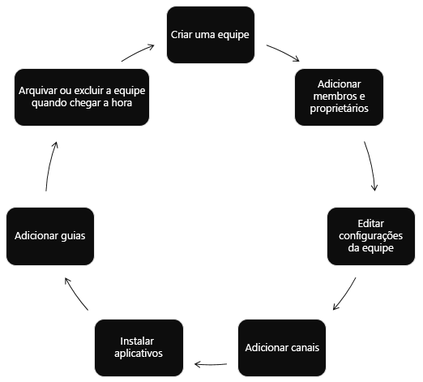

# Visão geral da API do Microsoft Teams

O [Microsoft Teams](https://products.office.com/microsoft-teams) é o melhor hub para trabalhos em equipe e comunicações inteligentes. Criado com base na força e na escala do [Office 365](https://products.office.com/), que conta com mais de 120 milhões de usuários, o Microsoft Teams oferece recursos de colaboração, reuniões, chamadas e voz empresarial baseados em bate-papo.

## Por que integrar-se com o Microsoft Teams?

### Automatizar o ciclo de vida da equipe

Use o Microsoft Graph para [criar uma nova equipe virtual](/graph/api/team-put-teams?view=graph-rest-1.0) quando surgir um novo problema de negócios, [preencher a equipe](/graph/api/group-post-members?view=graph-rest-1.0) com as pessoas certas e configurar a equipe com [canais](/graph/api/channel-post?view=graph-rest-1.0), [guias](/graph/api/teamstab-add?view=graph-rest-1.0) e [aplicativos](/graph/api/teamsappinstallation-add?view=graph-rest-1.0).
Se quiser reunir a nova equipe para discutir o problema de negócios, [adicione um novo evento](/graph/api/group-post-events?view=graph-rest-1.0) à agenda da equipe.

Quando o problema de negócios for resolvido e você já não precisar da equipe virtual, use a API do Microsoft Teams para [arquivar](/graph/api/team-archive?view=graph-rest-1.0) ou [excluir](/graph/api/group-delete?view=graph-rest-1.0) a equipe. Se, ao criar a equipe virtual, você souber qual será sua duração máxima, defina uma [política de expiração de grupo do Office 365](https://support.office.com/en-us/article/office-365-group-expiration-policy-8d253fe5-0e09-4b3c-8b5e-f48def064733?ui=en-US&rs=en-US&ad=US) para a equipe, que removerá a equipe automaticamente de acordo com a política.

### Faça com que o trabalho seja feito mesmo quando não houver ninguém por perto

Use [permissões de aplicativo](permissions-reference.md) para trabalhar com [equipes](/graph/api/resources/team?view=graph-rest-1.0), [canais](/graph/api/resources/channel?view=graph-rest-1.0), e [guias](/graph/api/resources/teamstab?view=graph-rest-1.0) sem intervenção humana. Crie um novo canal quando o cliente fizer um pedido.
Crie equipes automaticamente para aulas no início do ano letivo e arquive essas equipes no final.

### Criar equipes vinculadas ao seu aplicativo

Permita que os clientes criem novas [equipes](/graph/api/resources/team?view=graph-rest-1.0) e [canais](/graph/api/resources/channel?view=graph-rest-1.0). 
[Instale](/graph/api/teamsappinstallation-add?view=graph-rest-1.0) seu [Aplicativo de Equipes](https://docs.microsoft.com/pt-BR/microsoftteams/platform/#pivot=home&panel=home-all) nas novas equipes. 
[Fixe o aplicativo em uma guia](/graph/api/teamstab-add?view=graph-rest-1.0) no novo canal. 
[Envie mensagens](/graph/api/channel-post-chatthreads?view=graph-rest-beta) para o canal vinculando-o ao seu site.

### Criar e gerenciar várias equipes e canais

O Microsoft Graph facilita a criação de um grande número de equipes e seu preenchimento com usuários e canais, ao criar e gerenciar automaticamente [equipes](/graph/api/resources/team?view=graph-rest-1.0), [canais](/graph/api/resources/channel?view=graph-rest-1.0), [guias](/graph/api/resources/teamstab?view=graph-rest-1.0) e [aplicativos](/graph/api/resources/teamsapp?view=graph-rest-1.0).
O Microsoft Graph também permite [encontrar](teams-list-all-teams.md) e [arquivar](/graph/api/team-archive?view=graph-rest-1.0) equipes que você não está mais usando. Esta é a mesma API que em que são criados o [Centro Administrativo do Microsoft Teams](https://docs.microsoft.com/pt-BR/microsoftteams/enable-features-office-365) e as [cmdlets de Equipes do PowerShell](https://docs.microsoft.com/pt-BR/microsoftteams/teams-powershell-overview).

### Implantar aplicativos em equipes

[Liste as equipes em seu locatário](teams-list-all-teams.md), e [instale aplicativos](/graph/api/teamsappinstallation-add?view=graph-rest-1.0) para eles. 
[Crie guias](/graph/api/teamstab-add?view=graph-rest-1.0) em canais para conceder aos usuários acesso fácil aos aplicativos.

### Usar o Microsoft Graph em qualquer tipo de aplicativo

Os aplicativos do Microsoft Teams oferecem aos grupos de trabalho uma nova ferramenta para tornar a colaboração mais produtiva e atraente. Estes aplicativos permitem que os usuários do grupo compartilhem ativos, interajam por meio de bate-papo e agendem eventos no calendário da equipe. Estes aplicativos também podem automatizar a criação de equipes, canais e conversas, aumentando o valor do Microsoft Teams.

Você pode criar sites da web, serviços e aplicativos na plataforma nativa que são executados fora da experiência de usuário do Microsoft Teams, e chamar a API do Teams para automatizar cenários do Teams.

**Tipos de aplicativos habilitados para o Microsoft Teams**

Essas ferramentas de colaboração incluem guias habilitadas para o Microsoft Graph ou aplicativos de bot executados no Microsoft Teams. Você também pode chamar o Microsoft Graph fora de um aplicativo do Microsoft Teams, como de um site ou de serviço Web. Se já tiver habilitado seu site para o Microsoft Graph, você poderá usar esse trabalho para o Microsoft Teams utilizando a [plataforma de desenvolvedor do Microsoft Teams](https://docs.microsoft.com/pt-BR/microsoftteams/platform/#pivot=home&panel=home-all) para criar uma guia[ que usa o código de site existente.

As APIs do Microsoft Teams podem melhorar os aplicativos dentro e fora do Teams:

|Tipo de aplicativo|Descrição do cenário|
|:-------|:-------------------|
| [Guias](https://docs.microsoft.com/pt-BR/microsoftteams/platform/concepts/tabs/tabs-overview) |Exibem o conteúdo no Microsoft Teams.|
| [Bots](https://docs.microsoft.com/pt-BR/microsoftteams/platform/concepts/bots/bots-overview) |Ajudam os usuários a concluir tarefas em conversas.|
| [Conectores](https://docs.microsoft.com/pt-BR/microsoftteams/platform/concepts/connectors/connectors) |Postam atualizações de serviços externos para canais.|
| [Mensagens Acionáveis](https://docs.microsoft.com/pt-BR/microsoftteams/platform/concepts/cards/cards) |Adicionam interação aprimorada aos cartões do conector.|
| [Extensões de Mensagens](https://docs.microsoft.com/pt-BR/microsoftteams/platform/concepts/messaging-extensions) |Permitem que os usuários consultem e compartilhem informações em conversas.|
|Sites| Exibem conteúdo aprimorado em suas páginas da Web.|
|Serviços|Aprimoram seus aplicativos de cliente com dados do Microsoft Graph por meio do seu serviço Web.|
| [Feed de atividades](https://docs.microsoft.com/pt-BR/microsoftteams/platform/concepts/activity-feed)|Envolve os usuários por meio de notificações do feed.|
| [Chamadas e reuniões online (visualização)](/graph/api/resources/calls-api-overview?view=graph-rest-beta) |Crie aplicativos do Microsoft Teams usando bots podem iniciar e participar de chamadas de áudio/vídeo, rotear/transferir chamadas com base em fluxos de resposta de voz interativa (IVR) e participe de reuniões online.|

## Referência da API

Está procurando a referência de API para esse serviço?

Usar a API do [Teams no Microsoft Graph](/graph/api/resources/teams-api-overview?view=graph-rest-1.0).

## Próximas etapas

- Assista ao [vídeo de visão geral](https://aka.ms/teamsgraph/v1/video).
- Saiba como [usar a API do Microsoft Teams](/graph/api/resources/teams-api-overview?view=graph-rest-1.0).
- Analise em detalhes os métodos, propriedades e relações dos recursos de [equipe](/graph/api/resources/team?view=graph-rest-1.0), [canal](/graph/api/resources/channel?view=graph-rest-1.0) e [grupo](/graph/api/resources/group?view=graph-rest-1.0).
- Experimente a API no [Explorador do Graph](https://developer.microsoft.com/graph/graph-explorer).
- Leia mais sobre o [modelo de programação do Microsoft Teams](https://docs.microsoft.com/pt-BR/microsoftteams/platform/concepts/concepts-overview).
- Explore as [APIs de chamadas e reuniões online](/graph/api/resources/calls-api-overview?view=graph-rest-beta). 
- Comece a trabalhar com um exemplo de código: [Linhas Aéreas Contoso](https://github.com/microsoftgraph/contoso-airlines-teams-sample), [mini exemplos C#](https://github.com/microsoftgraph/csharp-teams-sample-graph)
