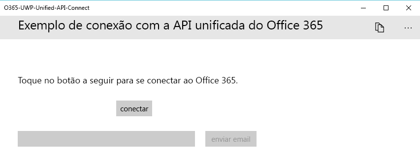
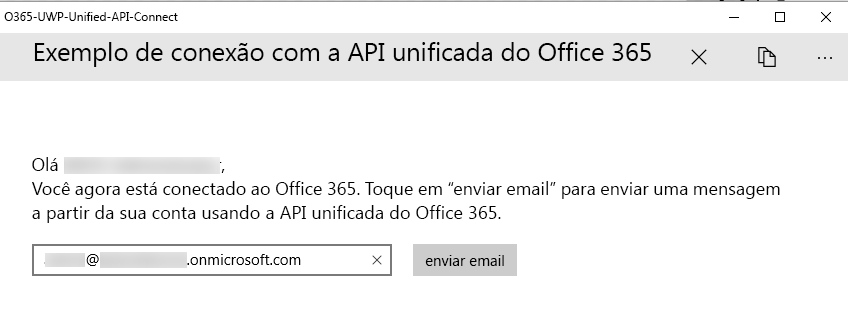

# <a name="get-started-with-microsoft-graph-in-a-universal-windows-10-app"></a>Introdução ao Microsoft Graph em um aplicativo universal do Windows 10

> **Criando aplicativos para clientes corporativos?** O aplicativo pode não funcionar caso o cliente corporativo habilite os recursos Enterprise Mobility + Security, como <a href="https://azure.microsoft.com/en-us/documentation/articles/active-directory-conditional-access-device-policies/" target="_newtab">acesso condicional ao dispositivo</a>. Nesse caso, pode ser que você não esteja ciente e seu cliente pode enfrentar problemas de erro. 

> Para dar suporte a **todos os clientes corporativos**, em **todos os cenários corporativos**, use o ponto de extremidade do Microsoft Azure AD e gerencie seus aplicativos usando o [Portal do Azure](https://aka.ms/aadapplist). Para saber mais, confira o tópico [Decidindo entre os pontos de extremidade do Microsoft Azure AD e do Microsoft Azure AD versão 2.0](../concepts/auth_overview.md#deciding-between-the-azure-ad-and-azure-ad-v20-endpoints).

Este artigo descreve as tarefas obrigatórias para obter um token de acesso do [ponto de extremidade do Azure AD v2.0](https://developer.microsoft.com/pt-BR/graph/docs/concepts/converged_auth) e chamar o Microsoft Graph. Ele o orienta em relação ao código dentro do [Exemplo de Conexão com o Microsoft Graph para UWP (Biblioteca)](https://github.com/microsoftgraph/uwp-csharp-connect-sample) para explicar os principais conceitos que você tem que implementar em um aplicativo que usa o Microsoft Graph.

**Não está com vontade de criar um aplicativo?** Use o [Início rápido do Microsoft Graph](https://developer.microsoft.com/graph/quick-start) para agilizar o processo ou baixe o [Exemplo de Conexão com o Microsoft Graph para UWP (Biblioteca)](https://github.com/microsoftgraph/uwp-csharp-connect-sample) no qual este artigo se baseia. Observe também que temos uma [Versão REST deste exemplo](https://github.com/microsoftgraph/uwp-csharp-connect-rest-sample).

## <a name="sample-user-interface"></a>Exemplo de interface do usuário

O exemplo contém uma interface do usuário muito simples, que consiste em uma barra de comando superior, um botão **Conectar**, um botão **Enviar email** e uma caixa de texto que é preenchida automaticamente com o endereço de email do usuário conectado, mas que pode ser editada.

O botão **Enviar email** é desabilitado quando o usuário não está conectado:



A barra de comando superior contém um botão Desconectar quando o usuário está conectado:



Todas as cadeias de caracteres de interface do usuário do exemplo são armazenadas no arquivo Resources.resw dentro da pasta Ativos.

## <a name="prerequisites"></a>Pré-requisitos

Para começar, será necessário: 

- Uma [conta da Microsoft](https://www.outlook.com/) ou uma [conta corporativa ou de estudante](https://docs.microsoft.com/pt-BR/office/developer-program/office-365-developer-program-faq#account-types)
- Visual Studio 2017 
- O [Projeto inicial do Microsoft Graph para UWP (Biblioteca)](https://github.com/microsoftgraph/uwp-csharp-connect-sample/tree/master/starter). Ambos os modelos contêm classes vazias às quais você adicionará código. Ele também contém cadeias de recursos. Para obter este projeto, clone ou baixe o [Exemplo de Conexão com o Microsoft Graph para UWP (Biblioteca)](https://github.com/microsoftgraph/uwp-csharp-connect-sample) e abra a solução dentro da pasta **starter**.


## <a name="register-the-app"></a>Registrar o aplicativo
 
1. Entre no [Portal de Registro do Aplicativo](https://apps.dev.microsoft.com/) usando sua conta pessoal ou sua conta corporativa ou de estudante.
2. Selecione **Adicionar um aplicativo**.
3. Insira um nome para o aplicativo e selecione **Criar aplicativo**.
    
    A página de registro é exibida, listando as propriedades do seu aplicativo.
 
4. Em **Plataformas**, selecione **Adicionar plataforma**.
5. Escolha **Aplicativo Nativo**.
6. Copie a ID de cliente (ID de aplicativo) e os valores do URI de redirecionamento para a área de transferência. Você precisará inserir esses valores no exemplo de aplicativo.

    Essa ID de aplicativo é o identificador exclusivo do aplicativo. Um URI de redirecionamento é um URI exclusivo fornecido pelo Windows 10 para cada aplicativo para garantir que as mensagens enviadas para esse URI sejam enviadas somente para esse aplicativo. 

7. Selecione **Salvar**.

## <a name="configure-the-project"></a>Configurar o projeto

1. Abra o arquivo de solução para o projeto inicial no Visual Studio.
2. Abra o arquivo **App.xaml** do projeto e localize o nó `Application.Resources`. Substitua a ID do aplicativo e redirecione espaços reservados do URI com os valores correspondentes do aplicativo que você registrou.


```xml
    <Application.Resources>
        <!-- Add your Client Id here. -->
        <x:String x:Key="ida:ClientID">ENTER_YOUR_CLIENT_ID</x:String>
        <!-- Add your Redirect URI here. -->
        <x:String x:Key="ida:ReturnUrl">ENTER_YOUR_REDIRECT_URI</x:String>
    </Application.Resources>
```

## <a name="send-an-email-with-microsoft-graph"></a>Enviar um email com o Microsoft Graph

Abra o arquivo MailHelper.cs em seu projeto inicial. Este arquivo contém o código que constrói e envia um email. Consiste em um único método, ``ComposeAndSendMailAsync``, que constrói e envia uma solicitação POST para o ponto de extremidade **https://graph.microsoft.com/v1.0/me/microsoft.graph.SendMail**. 

O método ``ComposeAndSendMailAsync`` tem três valores de cadeia de caracteres, ou seja, ``subject``, ``bodyContent`` e ``recipients``, que são passados para ele pelo arquivo MainPage.xaml.cs. As cadeias de caracteres ``subject`` e ``bodyContent`` são armazenadas, juntamente com todos os outras cadeias de caracteres de interface do usuário, no arquivo Resources.resw. A cadeia de caracteres ``recipients`` vem da caixa de endereço na interface do aplicativo. 

A primeira tarefa no método ``ComposeAndSendMailAsync`` é obter a foto do usuário atual a partir do Microsoft Graph. Esta linha chama o método `GetCurrentUserPhotoStreamAsync`:

```
            // Get current user photo
            Stream photoStream = await GetCurrentUserPhotoStreamAsync();
```

O método `GetCurrentUserPhotoStreamAsync` completo tem a seguinte aparência:

```
        // Gets the stream content of the signed-in user's photo. 
        // This snippet doesn't work with consumer accounts.
        public async Task<Stream> GetCurrentUserPhotoStreamAsync()
        {
            Stream currentUserPhotoStream = null;

            try
            {
                var graphClient = AuthenticationHelper.GetAuthenticatedClient();
                currentUserPhotoStream = await graphClient.Me.Photo.Content.Request().GetAsync();

            }

            // If the user account is MSA (not work or school), the service will throw an exception.
            catch (ServiceException)
            {
                return null;
            }

            return currentUserPhotoStream;

        }
```

Se o usuário não tiver uma foto, essa lógica obterá outro arquivo de imagem que foi incluído no projeto:

```
            // If the user doesn't have a photo, or if the user account is MSA, we use a default photo

            if (photoStream == null)
            {
                StorageFile file = await Windows.ApplicationModel.Package.Current.InstalledLocation.GetFileAsync("test.jpg");
                photoStream = (await file.OpenReadAsync()).AsStreamForRead();
            }
```

Agora que temos um fluxo de imagem, podemos carregar o arquivo no OneDrive chamando o método `UploadFileToOneDriveAsync`:

```
            MemoryStream photoStreamMS = new MemoryStream();
            // Copy stream to MemoryStream object so that it can be converted to byte array.
            photoStream.CopyTo(photoStreamMS);

            DriveItem photoFile = await UploadFileToOneDriveAsync(photoStreamMS.ToArray());
```

O método `UploadFileToOneDriveAsync` completo tem a seguinte aparência:

```
        // Uploads the specified file to the user's root OneDrive directory.
        public async Task<DriveItem> UploadFileToOneDriveAsync(byte[] file)
        {
            DriveItem uploadedFile = null;

            try
            {
                var graphClient = AuthenticationHelper.GetAuthenticatedClient();
                MemoryStream fileStream = new MemoryStream(file);
                uploadedFile = await graphClient.Me.Drive.Root.ItemWithPath("me.png").Content.Request().PutAsync<DriveItem>(fileStream);

            }


            catch (ServiceException)
            {
                return null;
            }

            return uploadedFile;
        }
```

Podemos também pode usar este fluxo para criar um objeto `MessageAttachmentsCollectionPage` que podemos passar junto com a mensagem:

```
            MessageAttachmentsCollectionPage attachments = new MessageAttachmentsCollectionPage();
            attachments.Add(new FileAttachment
            {
                ODataType = "#microsoft.graph.fileAttachment",
                ContentBytes = photoStreamMS.ToArray(),
                ContentType = "image/png",
                Name = "me.png"
            });
```

Podemos obter um link de compartilhamento para o arquivo do OneDrive recém-carregado chamando o método `GetSharingLinkAsync`. A cadeia de caracteres `bodyContent` contém um espaço reservado para o link de compartilhamento:

```
            // Get the sharing link and insert it into the message body.
            Permission sharingLink = await GetSharingLinkAsync(photoFile.Id);
            string bodyContentWithSharingLink = String.Format(bodyContent, sharingLink.Link.WebUrl);
```

O método `GetSharingLinkAsync` completo tem a seguinte aparência:

```
        public static async Task<Permission> GetSharingLinkAsync(string Id)
        {
            Permission permission = null;

            try
            {
                var graphClient = AuthenticationHelper.GetAuthenticatedClient();
                permission = await graphClient.Me.Drive.Items[Id].CreateLink("view").Request().PostAsync();
            }

            catch (ServiceException)
            {
                return null;
            }

            return permission;
        }
```

Já que o usuário pode passar mais de um endereço, a próxima tarefa é dividir a cadeia de caracteres ``recipients`` em uma coleção de objetos `EmailAddress` que podem ser usados para construir a lista de objetos `Recipients` que serão passados no corpo POST da solicitação:

```
            // Prepare the recipient list
            string[] splitter = { ";" };
            var splitRecipientsString = recipients.Split(splitter, StringSplitOptions.RemoveEmptyEntries);
            List<Recipient> recipientList = new List<Recipient>();

            foreach (string recipient in splitRecipientsString)
            {
                recipientList.Add(new Recipient { EmailAddress = new EmailAddress { Address = recipient.Trim() } });
            }
```

A última tarefa é construir um objeto `Message` e enviá-lo para o ponto de extremidade **me/microsoft.graph.SendMail** por meio de `GraphServiceClient`. Já que a cadeia de caracteres ``bodyContent`` é um documento HTML, a solicitação define o valor **ContentType** como HTML.

```
            try
            {
                var graphClient = AuthenticationHelper.GetAuthenticatedClient();

                var email = new Message
                {
                    Body = new ItemBody
                    {
                        Content = bodyContentWithSharingLink,
                        ContentType = BodyType.Html,
                    },
                    Subject = subject,
                    ToRecipients = recipientList,
                    Attachments = attachments
                };

                try
                {
                    await graphClient.Me.SendMail(email, true).Request().PostAsync();
                }
                catch (ServiceException exception)
                {
                    throw new Exception("We could not send the message: " + exception.Error == null ? "No error message returned." : exception.Error.Message);
                }


            }

            catch (Exception e)
            {
                throw new Exception("We could not send the message: " + e.Message);
            }
```

A classe completa terá a seguinte aparência:

```
    public class MailHelper
    {
        /// <summary>
        /// Compose and send a new email.
        /// </summary>
        /// <param name="subject">The subject line of the email.</param>
        /// <param name="bodyContent">The body of the email.</param>
        /// <param name="recipients">A semicolon-separated list of email addresses.</param>
        /// <returns></returns>
        public async Task ComposeAndSendMailAsync(string subject,
                                                            string bodyContent,
                                                            string recipients)
        {

            // Get current user photo
            Stream photoStream = await GetCurrentUserPhotoStreamAsync();


            // If the user doesn't have a photo, or if the user account is MSA, we use a default photo

            if (photoStream == null)
            {
                StorageFile file = await Windows.ApplicationModel.Package.Current.InstalledLocation.GetFileAsync("test.jpg");
                photoStream = (await file.OpenReadAsync()).AsStreamForRead();
            }

            MemoryStream photoStreamMS = new MemoryStream();
            // Copy stream to MemoryStream object so that it can be converted to byte array.
            photoStream.CopyTo(photoStreamMS);

            DriveItem photoFile = await UploadFileToOneDriveAsync(photoStreamMS.ToArray());

            MessageAttachmentsCollectionPage attachments = new MessageAttachmentsCollectionPage();
            attachments.Add(new FileAttachment
            {
                ODataType = "#microsoft.graph.fileAttachment",
                ContentBytes = photoStreamMS.ToArray(),
                ContentType = "image/png",
                Name = "me.png"
            });

            // Get the sharing link and insert it into the message body.
            Permission sharingLink = await GetSharingLinkAsync(photoFile.Id);
            string bodyContentWithSharingLink = String.Format(bodyContent, sharingLink.Link.WebUrl);

            // Prepare the recipient list
            string[] splitter = { ";" };
            var splitRecipientsString = recipients.Split(splitter, StringSplitOptions.RemoveEmptyEntries);
            List<Recipient> recipientList = new List<Recipient>();

            foreach (string recipient in splitRecipientsString)
            {
                recipientList.Add(new Recipient { EmailAddress = new EmailAddress { Address = recipient.Trim() } });
            }

            try
            {
                var graphClient = AuthenticationHelper.GetAuthenticatedClient();

                var email = new Message
                {
                    Body = new ItemBody
                    {
                        Content = bodyContentWithSharingLink,
                        ContentType = BodyType.Html,
                    },
                    Subject = subject,
                    ToRecipients = recipientList,
                    Attachments = attachments
                };

                try
                {
                    await graphClient.Me.SendMail(email, true).Request().PostAsync();
                }
                catch (ServiceException exception)
                {
                    throw new Exception("We could not send the message: " + exception.Error == null ? "No error message returned." : exception.Error.Message);
                }


            }

            catch (Exception e)
            {
                throw new Exception("We could not send the message: " + e.Message);
            }
        }


        // Gets the stream content of the signed-in user's photo. 
        // This snippet doesn't work with consumer accounts.
        public async Task<Stream> GetCurrentUserPhotoStreamAsync()
        {
            Stream currentUserPhotoStream = null;

            try
            {
                var graphClient = AuthenticationHelper.GetAuthenticatedClient();
                currentUserPhotoStream = await graphClient.Me.Photo.Content.Request().GetAsync();

            }

            // If the user account is MSA (not work or school), the service will throw an exception.
            catch (ServiceException)
            {
                return null;
            }

            return currentUserPhotoStream;

        }

        // Uploads the specified file to the user's root OneDrive directory.
        public async Task<DriveItem> UploadFileToOneDriveAsync(byte[] file)
        {
            DriveItem uploadedFile = null;

            try
            {
                var graphClient = AuthenticationHelper.GetAuthenticatedClient();
                MemoryStream fileStream = new MemoryStream(file);
                uploadedFile = await graphClient.Me.Drive.Root.ItemWithPath("me.png").Content.Request().PutAsync<DriveItem>(fileStream);

            }


            catch (ServiceException)
            {
                return null;
            }

            return uploadedFile;
        }

        public static async Task<Permission> GetSharingLinkAsync(string Id)
        {
            Permission permission = null;

            try
            {
                var graphClient = AuthenticationHelper.GetAuthenticatedClient();
                permission = await graphClient.Me.Drive.Items[Id].CreateLink("view").Request().PostAsync();
            }

            catch (ServiceException)
            {
                return null;
            }

            return permission;
        }

    }
``` 

 
Você já realizou as etapas obrigatórias para interagir com o Microsoft Graph: registro do aplicativo, autenticação do usuário e solicitações. 

## <a name="run-the-app"></a>Executar o aplicativo
1. Pressione F5 para criar e executar o aplicativo. 

2. Entre com sua conta pessoal, corporativa ou de estudante, e conceda as permissões solicitadas.

3. Escolha o botão **Enviar email**. Quando esse email é enviado, uma mensagem de Sucesso é exibida na parte inferior do botão. A mensagem de email inclui a foto em anexo e também fornece um link de compartilhamento para o arquivo carregado no OneDrive.

## <a name="next-steps"></a>Próximas etapas
- Experimente a API REST usando o [Explorador do Graph](https://developer.microsoft.com/pt-BR/graph/graph-explorer).
- Encontre exemplos de operações comuns para operações REST e SDK no [Exemplo de trechos de UWP do Microsoft Graph (SDK)](https://github.com/microsoftgraph/uwp-csharp-snippets-sample) e no [Exemplo de trechos de UWP do Microsoft Graph (REST)](https://github.com/microsoftgraph/uwp-csharp-snippets-rest-sample) ou explore nossos outros [exemplos de UWP](https://github.com/microsoftgraph?utf8=%E2%9C%93&query=uwp) no GitHub.

## <a name="see-also"></a>Confira também
- [Biblioteca de cliente do .NET do Microsoft Graph](https://github.com/microsoftgraph/msgraph-sdk-dotnet)
- [Protocolos do Azure AD v2.0](https://azure.microsoft.com/pt-BR/documentation/articles/active-directory-v2-protocols/)
- [Tokens do Azure AD v2.0](https://azure.microsoft.com/pt-BR/documentation/articles/active-directory-v2-tokens/)

